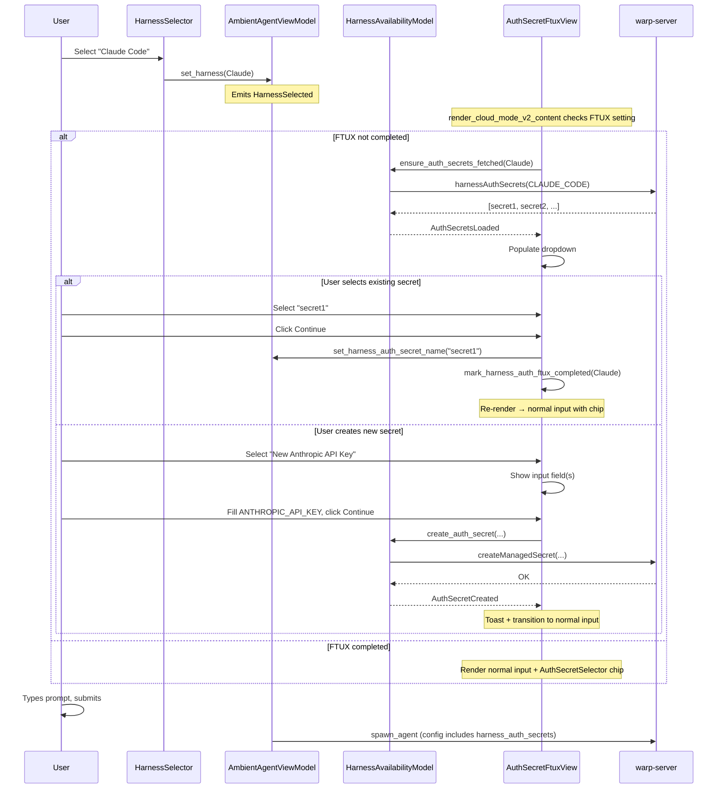

# Auth Secret Creation Flow — Tech Spec

## Problem

The cloud mode input V2 composing UI lets users select a non-Oz harness (e.g. Claude Code), but has no way to associate an auth secret with that harness. The server already supports `harnessAuthSecrets` (query) and `createManagedSecret` (mutation), and `AgentConfigSnapshot` already has a `harness_auth_secrets` field — but the client never populates it. We need to add the UI for selecting/creating auth secrets and wire the selection into the spawn config.

## Relevant Code

### Client (warp-internal)

- `app/src/ai/harness_availability.rs` — `HarnessAvailabilityModel` singleton. Fetches and caches harness availability from the server. **Will be extended** with per-harness auth secret state.
- `app/src/terminal/view/ambient_agent/harness_selector.rs` — `HarnessSelector` view (`ActionButton` + `Menu<A>`). The auth secret selector chip mirrors this pattern.
- `app/src/terminal/view/ambient_agent/model.rs` (165-221) — `AmbientAgentViewModel`. Tracks `harness`, `worker_host`, `harness_model_id`. **Will add** `harness_auth_secret_name`.
- `app/src/terminal/view/ambient_agent/model.rs` (841-861) — `build_default_spawn_config()`. Builds `AgentConfigSnapshot`. **Will add** `harness_auth_secrets` population.
- `app/src/ai/ambient_agents/task.rs` (27-65) — `AgentConfigSnapshot` struct. Already has `harness_auth_secrets: Option<HarnessAuthSecretsConfig>` with `claude_auth_secret_name`.
- `app/src/terminal/input/agent.rs` (507-525) — `render_cloud_mode_v2_content()`. Builds `top_row + input_container`. **Branch point** for FTUX vs normal rendering.
- `app/src/terminal/input/agent.rs` (539-556) — `render_cloud_mode_v2_top_row()`. **Will add** `AuthSecretSelector` chip conditionally.
- `app/src/server/server_api/managed_secrets.rs` — `ManagedSecretsClient` trait. Has `create_managed_secret` and `list_secrets`. **Will add** `list_harness_auth_secrets`.

### Server (warp-server) — read-only, no changes needed

- `graphql/v2/queries/managed_secrets.graphqls` — `harnessAuthSecrets` query, `ListHarnessAuthSecretsInput`, `HarnessAuthSecretsResult`.
- `graphql/v2/mutations/create_managed_secret.graphqls` — `createManagedSecret` mutation.
- `model/types/enums/managed_secret_type.go` (46-52) — `authSecretTypesByHarness` map. Claude Code maps to 3 types.
- `logic/managed_secrets/secret_type.go` — Secret value structs and their JSON field shapes.

### GraphQL client crate

- `crates/warp_graphql` — cynic-based GraphQL query modules. **Will add** `list_harness_auth_secrets` query module.

## Current State

- `HarnessAvailabilityModel` fetches harness metadata on auth/network/workspace changes and caches it. It has no awareness of auth secrets.
- `AmbientAgentViewModel` tracks harness selection and builds the spawn config, but never sets `harness_auth_secrets`.
- The cloud mode V2 composing UI renders a top row (host + harness selectors) and an input container below it. There is no auth secret UI.
- The oz web app (`client/packages/agents/src/components/HarnessAuthSecretSelector`) already has a React component and `useHarnessAuthSecrets` hook that query the same server endpoint.

## Proposed Changes

### 1. GraphQL query: `harnessAuthSecrets`

**New file**: `crates/warp_graphql/src/queries/list_harness_auth_secrets.rs`

Add a cynic query module for the server's `harnessAuthSecrets` query. The input takes an `AgentHarness` enum; the output reuses the existing `ManagedSecret` fragment.

```rust
#[derive(cynic::QueryVariables)]
pub struct ListHarnessAuthSecretsVariables {
    pub request_context: RequestContext,
    pub input: ListHarnessAuthSecretsInput,
}

#[derive(cynic::InputObject)]
pub struct ListHarnessAuthSecretsInput {
    pub harness: AgentHarness,
}

#[derive(cynic::QueryFragment)]
#[cynic(graphql_type = "RootQuery", variables = "ListHarnessAuthSecretsVariables")]
pub struct ListHarnessAuthSecrets {
    #[arguments(requestContext: $request_context, input: $input)]
    pub harness_auth_secrets: HarnessAuthSecretsResult,
}
```

Extend `ManagedSecretsClient` in `app/src/server/server_api/managed_secrets.rs`:

```rust
async fn list_harness_auth_secrets(
    &self,
    harness: AgentHarness,
) -> Result<Vec<ManagedSecret>>;
```

### 2. Extend `HarnessAvailabilityModel` with auth secrets

**File**: `app/src/ai/harness_availability.rs`

Add a lazily-fetched per-harness auth secret map to the existing singleton, keeping all harness-related data in one place.

```rust
pub struct HarnessAvailabilityModel {
    harnesses: Vec<HarnessAvailability>,
    /// Lazily fetched when a non-Oz harness is selected.
    auth_secrets: HashMap<Harness, AuthSecretFetchState>,
}

pub enum AuthSecretFetchState {
    NotFetched,
    Loading,
    Loaded(Vec<AuthSecretEntry>),
    Failed(String),
}

pub struct AuthSecretEntry {
    pub name: String,
}
```

New events added to `HarnessAvailabilityEvent`:

```rust
pub enum HarnessAvailabilityEvent {
    Changed,
    AuthSecretsLoaded { harness: Harness },
    AuthSecretCreated { harness: Harness, name: String },
    AuthSecretCreationFailed { error: String },
}
```

Key new methods:

- `auth_secrets_for(&self, harness) -> &AuthSecretFetchState` — returns current state for the harness.
- `ensure_auth_secrets_fetched(&mut self, harness, ctx)` — if `NotFetched`, fires async `list_harness_auth_secrets` and transitions to `Loading`. On success, stores `Loaded(entries)` and emits `AuthSecretsLoaded`.
- `create_auth_secret(&self, harness, name, secret_type, field_values, ctx)` — encrypts value JSON, calls `create_managed_secret`, appends to cached list, emits `AuthSecretCreated`.
- `invalidate_auth_secrets(&mut self, harness)` — resets to `NotFetched`.

### 3. Auth secret type metadata

**New file**: `app/src/ai/auth_secret_types.rs`

Client-side mirror of the server's `authSecretTypesByHarness`. Maps each harness to its secret types and their input field schemas.

```rust
pub struct AuthSecretTypeField {
    pub label: &'static str,
    pub json_key: &'static str,
    pub optional: bool,
}

pub struct AuthSecretTypeInfo {
    pub display_name: &'static str,
    pub secret_type: &'static str,
    pub fields: &'static [AuthSecretTypeField],
}

pub fn auth_secret_types_for_harness(harness: Harness) -> &'static [AuthSecretTypeInfo] {
    match harness {
        Harness::Claude => &[
            AuthSecretTypeInfo {
                display_name: "Anthropic API Key",
                secret_type: "anthropic_api_key",
                fields: &[
                    AuthSecretTypeField { label: "ANTHROPIC_API_KEY", json_key: "api_key", optional: false },
                ],
            },
            AuthSecretTypeInfo {
                display_name: "Bedrock API Key",
                secret_type: "anthropic_bedrock_api_key",
                fields: &[
                    AuthSecretTypeField { label: "AWS_BEARER_TOKEN_BEDROCK", json_key: "aws_bearer_token_bedrock", optional: false },
                    AuthSecretTypeField { label: "AWS_REGION", json_key: "aws_region", optional: false },
                ],
            },
            AuthSecretTypeInfo {
                display_name: "Bedrock Access Key",
                secret_type: "anthropic_bedrock_access_key",
                fields: &[
                    AuthSecretTypeField { label: "AWS_ACCESS_KEY_ID", json_key: "aws_access_key_id", optional: false },
                    AuthSecretTypeField { label: "AWS_SECRET_ACCESS_KEY", json_key: "aws_secret_access_key", optional: false },
                    AuthSecretTypeField { label: "AWS_SESSION_TOKEN", json_key: "aws_session_token", optional: true },
                    AuthSecretTypeField { label: "AWS_REGION", json_key: "aws_region", optional: false },
                ],
            },
        ],
        _ => &[],
    }
}
```

### 4. Per-harness FTUX setting

**File**: `app/src/ai/settings.rs` (or equivalent)

```rust
pub static HARNESS_AUTH_FTUX_COMPLETED: Setting<HashMap<String, bool>> = Setting::new(
    "harness_auth_ftux_completed",
    HashMap::new(),
);

pub fn is_harness_auth_ftux_completed(harness: Harness) -> bool { ... }
pub fn mark_harness_auth_ftux_completed(harness: Harness) { ... }
```

### 5. `AmbientAgentViewModel` changes

**File**: `app/src/terminal/view/ambient_agent/model.rs`

Add field:

```rust
harness_auth_secret_name: Option<String>,
```

Update `set_harness()` to clear `harness_auth_secret_name` when harness changes.

Update `build_default_spawn_config()` to populate `harness_auth_secrets`:

```rust
let harness_auth_secrets = self.harness_auth_secret_name.as_ref().map(|name| {
    HarnessAuthSecretsConfig {
        claude_auth_secret_name: Some(name.clone()),
    }
});
```

Add getter/setter and new event `AuthSecretSelected`.

### 6. Auth Secret FTUX View

**New file**: `app/src/terminal/view/ambient_agent/auth_secret_ftux_view.rs`

A `TypedActionView` that renders the FTUX content. Owns the creation sub-flow UI state:

```rust
pub struct AuthSecretFtuxView {
    ambient_agent_model: ModelHandle<AmbientAgentViewModel>,
    /// Dropdown + menu for selecting existing secrets or "New" types.
    dropdown: ViewHandle<...>,
    /// Current creation state, if user selected "New {type}".
    creation_state: Option<SecretCreationState>,
    /// Whether to show the "Click here to skip" link.
    show_skip_link: bool,
}

pub struct SecretCreationState {
    pub secret_type_index: usize,
    pub field_values: Vec<String>,
    pub is_saving: bool,
}
```

Subscribes to `HarnessAvailabilityModel` for `AuthSecretsLoaded` to populate the dropdown. Calls `ensure_auth_secrets_fetched` on construction.

Actions: `Cancel`, `Continue`, `Skip`, `SelectSecret(String)`, `SelectNewType(usize)`, `UpdateField { index, value }`.

### 7. Auth Secret Selector Chip

**New file**: `app/src/terminal/view/ambient_agent/auth_secret_selector.rs`

Mirrors `HarnessSelector`: `ActionButton` + `Menu<A>` + `MenuPositioningProvider`.

```rust
pub struct AuthSecretSelector {
    button: ViewHandle<ActionButton>,
    menu: ViewHandle<Menu<AuthSecretSelectorAction>>,
    is_menu_open: bool,
    menu_positioning_provider: Arc<dyn MenuPositioningProvider>,
    ambient_agent_model: ModelHandle<AmbientAgentViewModel>,
}
```

Subscribes to `HarnessAvailabilityModel` for `AuthSecretsLoaded` / `AuthSecretCreated` to refresh menu items. Uses `NakedHeaderButtonTheme`. Shows key icon + secret name + chevron-down.

### 8. Rendering tree integration

**File**: `app/src/terminal/input/agent.rs`

The branch point is `render_cloud_mode_v2_content` (line 507-525). Currently:

```
render_cloud_mode_v2_content()
└── Align (centered)
    └── ConstrainedBox (max-width: 720px)
        └── Flex::column (gap: 10px)
            ├── render_cloud_mode_v2_top_row()          ← ALWAYS rendered
            └── render_cloud_mode_v2_input_container()  ← normal input
```

With FTUX active (non-Oz harness + FTUX not completed):

```
render_cloud_mode_v2_content()
└── Align (centered)
    └── ConstrainedBox (max-width: 720px)
        └── Flex::column (gap: 10px)
            ├── render_cloud_mode_v2_top_row()   ← SAME
            └── ChildView::new(&auth_secret_ftux_view)  ← replaces input container
```

With FTUX completed (returning user):

```
render_cloud_mode_v2_content()
└── Align (centered)
    └── ConstrainedBox (max-width: 720px)
        └── Flex::column (gap: 10px)
            ├── render_cloud_mode_v2_top_row()
            │   └── HostSelector | HarnessSelector | AuthSecretSelector | ...
            └── render_cloud_mode_v2_input_container()   ← normal input
```

The top row always renders. The second child swaps based on `should_show_auth_secret_ftux()`.

### 9. Toast notification

Subscribe to `HarnessAvailabilityEvent::AuthSecretCreated` in `Input` and show an ephemeral `DismissibleToast` via `ToastStack`: "API key saved." with a "Manage secrets" action button.

## End-to-End Flow



## Risks and Mitigations

- **Shared singleton mutation**: `HarnessAvailabilityModel` is a singleton; adding mutable auth secret state must not interfere with the existing harness availability data. Mitigated by using a separate `HashMap` field that is never touched by the existing `refresh()` path.
- **Lazy fetch timing**: The FTUX view calls `ensure_auth_secrets_fetched` on construction. If the fetch is slow, the dropdown shows a loading state. The user cannot hit Continue until secrets are loaded or they enter a raw value.
- **Secret encryption**: Creating a secret requires client-side encryption using the user's upload key. The existing `ManagedSecretsClient::create_managed_secret` already handles this — we reuse that path.
- **Feature flag coupling**: This feature requires `CloudModeInputV2` and `CloudMode` and `AgentHarness` flags to all be enabled. If any is off, none of the new code runs.
- **Stale cache**: After creating a secret, we append to the cached list optimistically. If the server rejects the creation, we show an error toast and don't modify the cache.

## Testing and Validation

- **Unit tests**: `auth_secret_types_for_harness` returns correct field schemas for Claude and empty for Oz/Unknown. FTUX setting helpers round-trip correctly.
- **Compile check**: `cargo check` with and without the `cloud_mode_input_v2` feature flag.
- **Manual verification**:
  1. Select Claude Code → FTUX appears, top row persists, dropdown populates from server.
  2. Select existing secret → Continue → normal input with chip showing selected secret.
  3. Select "New Anthropic API Key" → 1 field appears → fill → Continue → toast + chip updates.
  4. Select "New Bedrock Access Key" → 4 fields appear (1 optional) → fill required → Continue.
  5. Cancel → returns to Oz. Skip → proceeds with no secret.
  6. Restart app → re-select Claude Code → FTUX skipped, chip shows previous secret.
  7. Submit prompt → verify `harness_auth_secrets.claude_auth_secret_name` is set in the spawn request.

## Follow-ups

- Extend `auth_secret_types_for_harness` when new harnesses (e.g. Gemini, Codex) are added.
- Support raw-value passthrough (type the API key directly without creating a named secret).
- Add the "Manage secrets" toast button action to open the Warp Drive secrets pane.
- Consider pre-selecting the most recently used secret when returning to the FTUX or chip.
