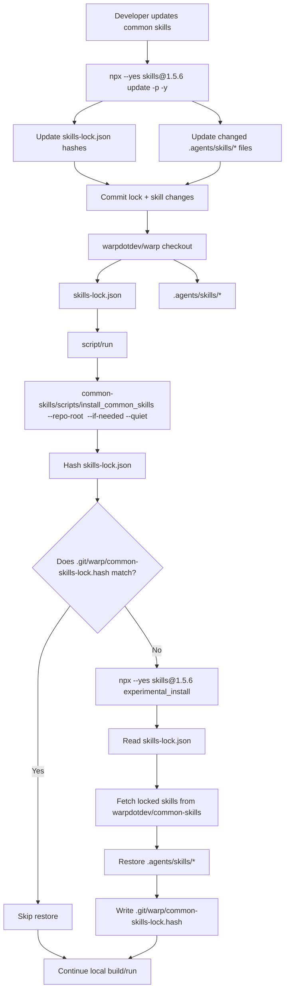
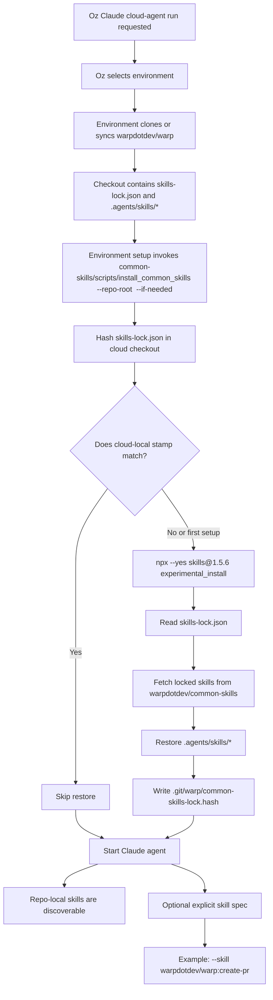

# Common Skills Installation — Tech Spec

## Context
This PR replaces the custom `.agents/common-skills.lock` flow with the standard project lock managed by `npx skills`. The checked-in `skills-lock.json` records each common skill from `warpdotdev/common-skills`, including its source, skill path, and content hash (`skills-lock.json:1`). The repository also checks in the restored `.agents/skills/*` copies so local and cloud agents can discover skills directly from the checkout.

The main install entrypoint is `warpdotdev/common-skills/scripts/install_common_skills`. It targets a Warp checkout through `--repo-root <warp-checkout>` or `WARP_COMMON_SKILLS_TARGET_REPO_ROOT`, points at that checkout's `skills-lock.json`, and stores a local, untracked stamp under the target checkout's `.git/warp/common-skills-lock.hash`. If the lock is missing, the script creates it by installing the standard common skill set from `warpdotdev/common-skills` with the pinned `skills` CLI. The script hashes the lock and skips work when that hash matches the stamp. When the stamp is missing or stale, it restores from the lock by running `npx --yes "skills@${SKILLS_CLI_VERSION}" experimental_install` and writes the new stamp. Successful install and skip paths verify that exactly one target contains common skills and that installed contents match `skills-lock.json`.

`script/run` checks common skills before launching a local build. It enables the check by default and executes the installer through `script/resolve_common_skills`, which uses `WARP_COMMON_SKILLS_SCRIPTS_DIR`, a sibling `common-skills` checkout or worktree, or the raw script from `warpdotdev/common-skills`. `WARP_COMMON_SKILLS_FORCE_REMOTE=1` skips local lookup so developers can exercise the raw-script path, and `WARP_COMMON_SKILLS_REF=<branch>` selects a non-main common-skills ref for that fallback. `script/run` then delegates install target resolution to `warpdotdev/common-skills/scripts/install_common_skills --repo-root <warp-checkout> --if-needed --non-interactive --quiet` unless the user explicitly passes `--install-common-skills`, which forces a restore. `script/bootstrap` also installs common skills by default and delegates target resolution to the same installer. `WARP.md` documents the standard update command and the files reviewers should expect to change.

## Diagrams
### Local agent installation and update flow

### Oz cloud agent environment setup flow

## Proposed changes
The implementation should keep `skills-lock.json` as the single source of truth for common skills installed from `warpdotdev/common-skills`. The repo should not maintain a second custom lock format or a separate GitHub workflow for scheduled common-skill updates.

`warpdotdev/common-skills/scripts/install_common_skills` owns lock creation and restoration from the lock for a target checkout. It should remain small and deterministic: if `skills-lock.json` is missing, create it from the pinned common-skill source; otherwise compute a hash for `skills-lock.json`, compare it with a checkout-local stamp, run `npx --yes skills@1.5.6 experimental_install` only when needed, and update the stamp after a successful restore. The stamp belongs under the target checkout's `.git` so normal restore runs do not create or modify tracked files unless the lock itself has been updated intentionally.

`warpdotdev/common-skills/scripts/install_common_skills` should own install target resolution. By default it should reuse the single target that already contains common skills, prompt with global as the recommended default when neither project-local nor global common skills are present, and fail when both targets contain common skills. When bootstrap delegates to the installer, it should request a prompt before any install or update unless the user explicitly provided a target flag or environment override.

`script/run` should call the installer before building so local developer runs pick up lock changes automatically. This makes `script/run` the dependency-update check point requested during review: when a branch changes `skills-lock.json`, the next run restores the matching skill contents without requiring a separate workflow. `--install-common-skills` is retained as a force-install escape hatch.

`script/bootstrap` should delegate to the same installer by default, while retaining `--skip-common-skills` as an opt-out. If bootstrap needs to install or update common skills and no target was explicitly provided, it should ask the user whether to install project-local or globally. This keeps platform setup and normal run setup consistent while avoiding surprising writes.

For Oz cloud runs, this PR provides the common-skills-side installer that environment setup should call after cloning or syncing the repository and before starting the Claude agent. A fresh environment will have no `.git/warp/common-skills-lock.hash`, so `common-skills/scripts/install_common_skills --repo-root <warp-checkout> --if-needed` restores from `skills-lock.json` once. A reused environment skips the restore when the stamp matches the checked-out lock. After this step, the Claude agent can discover repo-local checked-in skills, and Oz can still pass an explicit skill spec such as `warpdotdev/warp:create-pr` when the run should start from a specific skill. The Oz environment hook itself lives outside this repo; the implementation boundary here is making the repo checkout self-sufficient and idempotent when that hook invokes the script.

Updates to common skills should be explicit developer actions: run `npx --yes skills@1.5.6 update -p -y`, review the generated `skills-lock.json` and `.agents/skills/*` changes, and commit them together. This preserves dependency-review semantics without adding repository-specific scheduled automation.

## Testing and validation
Validate the shell changes with `bash -n <common-skills>/scripts/install_common_skills <common-skills>/scripts/remove_common_skills script/resolve_common_skills script/run script/bootstrap`.

Validate the Windows bootstrap script parses with PowerShell: `pwsh -NoProfile -Command '$null = [scriptblock]::Create((Get-Content -Raw "script/windows/bootstrap.ps1"))'`.

Validate the missing-lock path by removing common skills and the lock, then running `<common-skills>/scripts/install_common_skills --repo-root <warp-checkout> --project --if-needed --non-interactive`. It should run the pinned `skills@1.5.6 add warpdotdev/common-skills` command, create `skills-lock.json`, restore `.agents/skills/*`, and write `.git/warp/common-skills-lock.hash`.

Validate the restore path by running `<common-skills>/scripts/install_common_skills --repo-root <warp-checkout> --if-needed --quiet` from a checkout without a matching local stamp but with an existing lock. It should run the pinned `skills@1.5.6` restore command, restore the locked `.agents/skills/*` contents, and write `.git/warp/common-skills-lock.hash`.

Validate the skip path by running `<common-skills>/scripts/install_common_skills --repo-root <warp-checkout> --if-needed --quiet` again. It should exit successfully without output and without changing the worktree.

Validate update behavior by running `npx --yes skills@1.5.6 update -p -y` in a test checkout or intentional update branch. If upstream common skills changed, the diff should be limited to `skills-lock.json` and the affected `.agents/skills/*` files.
