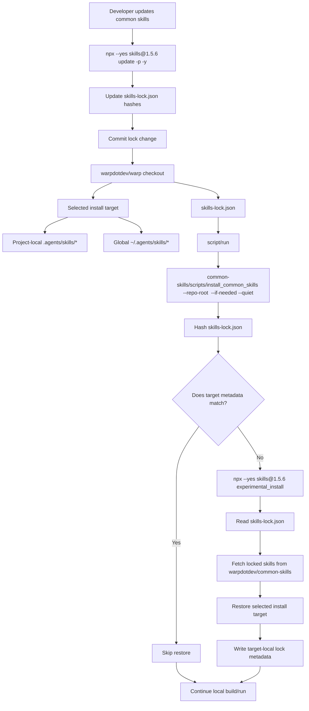
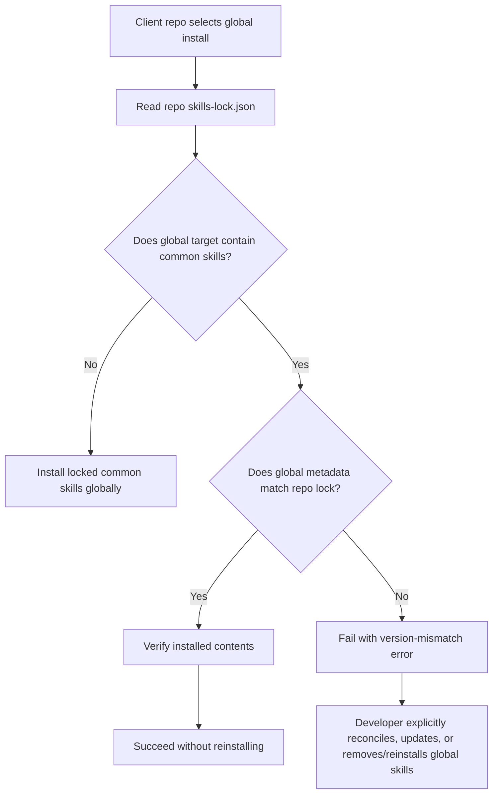

# Common Skills Installation — Tech Spec

## Context
This PR replaces the custom `.agents/common-skills.lock` flow with the standard project lock managed by `npx skills`. The checked-in `skills-lock.json` records each common skill from `warpdotdev/common-skills`, including its source, skill path, and content hash (`skills-lock.json:1`). Installed skill copies are local developer state: they may live in the checkout's project-local skills directory or in the user's global agent skills directory, but they are not source-controlled. For project-local installs, the installer ignores only the locked common-skill paths so unrelated project skills in `.agents/skills` remain visible to Git.

The main install entrypoint is `warpdotdev/common-skills/scripts/install_common_skills`. It targets a Warp checkout through `--repo-root <warp-checkout>` or `WARP_COMMON_SKILLS_TARGET_REPO_ROOT`, points at that checkout's `skills-lock.json`, and installs into an explicit target selected by `--project`, `--global`, `WARP_COMMON_SKILLS_INSTALL_TARGET`, or an interactive prompt. If the lock is missing during a normal install, the script creates it by installing the standard common skill set from `warpdotdev/common-skills` with the pinned `skills` CLI. When `WARP_COMMON_SKILLS_REF=<git-ref>` is set, missing-lock creation uses `warpdotdev/common-skills#<git-ref>`. If the lock exists during an interactive normal install, the script checks whether adding the selected common-skills source in a temporary directory would produce a different lock and, when it would, prompts the developer before changing `skills-lock.json`. If the lock is missing during `--verify-only`, the script fails immediately without prompting or creating files.

The script hashes `skills-lock.json` and records target-local install metadata after a successful restore. Project-local installs use checkout-local metadata under `.git` so normal restore runs do not create tracked files. Global installs use global target metadata so different client repositories can verify whether the shared global install is pinned to the same lock. If a global install already matches the requested lock, setup verifies and succeeds. If it is pinned to a different lock, setup fails with an actionable version-mismatch error instead of silently overwriting the shared global copy. Successful install and skip paths verify that exactly one target contains common skills and that installed contents match `skills-lock.json`.

`script/run` checks common skills before launching a local build. It enables the check by default and executes the installer through `script/resolve_common_skills`, which uses the raw script from `warpdotdev/common-skills` unless the developer explicitly sets `WARP_COMMON_SKILLS_SCRIPTS_DIR` to a local common-skills checkout or worktree. `WARP_COMMON_SKILLS_REF=<branch>` selects a non-main common-skills ref for the remote script path and is inherited by the installer as the common-skills source ref for missing-lock creation and interactive update checks. `script/run` then calls `warpdotdev/common-skills/scripts/install_common_skills --repo-root <warp-checkout> --if-needed --prompt-for-target --quiet` when no explicit target was provided, or passes `--project`/`--global` when `WARP_COMMON_SKILLS_INSTALL_TARGET` selected a target. `--install-common-skills` forces a restore using the same target-resolution behavior. `script/bootstrap` also installs common skills by default and delegates target resolution to the same installer, allowing the installer to prompt first for an upstream lock update and then for the install target when those choices are needed. `WARP.md` documents the standard update command and the files reviewers should expect to change.

## Diagrams
### Local agent installation and update flow

### Global target compatibility flow

## Proposed changes
The implementation should keep `skills-lock.json` as the single source of truth for common skills installed from `warpdotdev/common-skills`. The repo should not maintain a second custom lock format or a separate GitHub workflow for scheduled common-skill updates.

`warpdotdev/common-skills/scripts/install_common_skills` owns lock creation and restoration from the lock for a target checkout. It should remain small and deterministic: if `skills-lock.json` is missing during a normal install, create it from the pinned common-skill source; otherwise compute a hash for `skills-lock.json`, compare it with target-local metadata, run `npx --yes skills@1.5.6 experimental_install` only when needed and allowed, and update the metadata after a successful restore. Project-local metadata belongs under the target checkout's `.git` so normal restore runs do not create or modify tracked files unless the lock itself has been updated intentionally. Global metadata belongs with the global install target so multiple client repos can detect whether they are pinned to the same common-skills lock.

`warpdotdev/common-skills/scripts/install_common_skills` should own install target resolution, but target selection must be explicit. The installer accepts `--project`, `--global`, or `WARP_COMMON_SKILLS_INSTALL_TARGET`; if none is provided in an interactive invocation, it prompts with global as the recommended default. If none is provided in a non-interactive invocation, it fails with an actionable error. It must not infer the target from an existing project-local or global install. It should also fail when both targets contain common skills, suggesting `remove_common_skills --repo-root <warp-checkout>` for the project-local copy or `remove_common_skills --repo-root <warp-checkout> --global` for the global copy.

For interactive normal install flows with an existing lock, `install_common_skills` should compute a candidate updated lock in a temporary directory before resolving the install target. The candidate is generated by adding `warpdotdev/common-skills`, or `warpdotdev/common-skills#<git-ref>` when `WARP_COMMON_SKILLS_REF` is set, with the pinned `skills` CLI. If the candidate lock differs from the checkout's `skills-lock.json`, the script should print that common skills have been updated in the selected source and ask whether to update the checkout lock and reinstall. Accepting copies the candidate lock into the checkout, marks the flow as an explicit lock update, and continues to target resolution and install. Declining discards the candidate and continues from the existing lock. Non-interactive and verify-only flows skip this upstream check entirely.

`script/run` should call the installer before building so local developer runs validate lock changes automatically. This makes `script/run` the dependency-update check point requested during review: when a branch changes `skills-lock.json`, the next run restores the matching project-local target or compatible global target without requiring a separate workflow. If no target was provided, run should use the same interactive target prompt as bootstrap; if no prompt is available, the installer should fail with the same actionable target-selection error. If the global target is pinned to a different lock, run should fail before launching Warp. `--install-common-skills` is retained as a force-install escape hatch, subject to the same target-resolution behavior and global version-mismatch guard.

`script/bootstrap` should delegate to the same installer by default, while retaining `--skip-common-skills` as an opt-out. If bootstrap needs to install or update common skills and no target was explicitly provided, it should ask the user whether to install project-local or globally. This keeps platform setup and normal run setup consistent while avoiding surprising writes.

`script/resolve_common_skills` should default to executing the remote raw script from `warpdotdev/common-skills`. Local common-skills checkouts or worktrees are used only when `WARP_COMMON_SKILLS_SCRIPTS_DIR` is set. `WARP_COMMON_SKILLS_REF` selects the remote branch, tag, or commit to fetch and is also consumed by `install_common_skills` when selecting the common-skills source for missing-lock creation and interactive update checks. Because the remote script is executed through a pipe, installer child commands that might read stdin should redirect from `/dev/null` so they cannot consume the remaining script body before the restore and verification steps run. No separate `WARP_COMMON_SKILLS_FORCE_REMOTE` option is needed because remote execution is already the default.

Updates to common skills should be explicit developer actions: accept the interactive bootstrap/install prompt or run `npx --yes skills@1.5.6 update -p -y`, review the generated `skills-lock.json` changes, and commit them. This preserves dependency-review semantics without adding repository-specific scheduled automation.

## Testing and validation
Validate the shell changes with `bash -n <common-skills>/scripts/install_common_skills <common-skills>/scripts/remove_common_skills script/resolve_common_skills script/run script/bootstrap`.

Validate the Windows bootstrap script parses with PowerShell: `pwsh -NoProfile -Command '$null = [scriptblock]::Create((Get-Content -Raw "script/windows/bootstrap.ps1"))'`.

Validate the missing-lock path by removing common skills and the lock, then running `<common-skills>/scripts/install_common_skills --repo-root <warp-checkout> --project --if-needed --non-interactive`. It should run the pinned `skills@1.5.6 add warpdotdev/common-skills` command, create `skills-lock.json`, restore the selected project-local target, and write project-local metadata.

Validate the restore path by running `<common-skills>/scripts/install_common_skills --repo-root <warp-checkout> --project --if-needed --quiet` from a checkout without matching project-local metadata but with an existing lock. It should run the pinned `skills@1.5.6` restore command, restore the selected project-local target, and write project-local metadata.

Validate the skip path by running `<common-skills>/scripts/install_common_skills --repo-root <warp-checkout> --project --if-needed --quiet` again. It should exit successfully without output and without changing the worktree.

Validate global sharing by installing common skills globally from two test checkouts with identical `skills-lock.json` contents. The second install should verify and succeed without unnecessarily reinstalling. Then change one checkout's lock and run global setup again; it should fail with the version-mismatch error rather than overwriting the shared global target.

Validate explicit target selection by running the installer in non-interactive mode without `--project`, `--global`, or `WARP_COMMON_SKILLS_INSTALL_TARGET`. It should fail with an actionable target-selection error and must not infer the target from existing installs.

Validate interactive update behavior by using a test checkout whose `skills-lock.json` differs from the current `warpdotdev/common-skills` output and running `<common-skills>/scripts/install_common_skills --repo-root <test-checkout> --if-needed --prompt-for-target`. Before the project/global prompt, the script should report that common skills have been updated and ask whether to update the lock. Accepting should change only `skills-lock.json` before target installation; declining should leave the lock unchanged and continue from the existing lock. Also validate `WARP_COMMON_SKILLS_REF=<branch>` with a branch whose skill content differs from the lock; the update prompt should compare against the branch source and the accepted lock should record that ref.

Validate manual update behavior by running `npx --yes skills@1.5.6 update -p -y` in a test checkout or intentional update branch. If upstream common skills changed, the diff should be limited to `skills-lock.json`.
