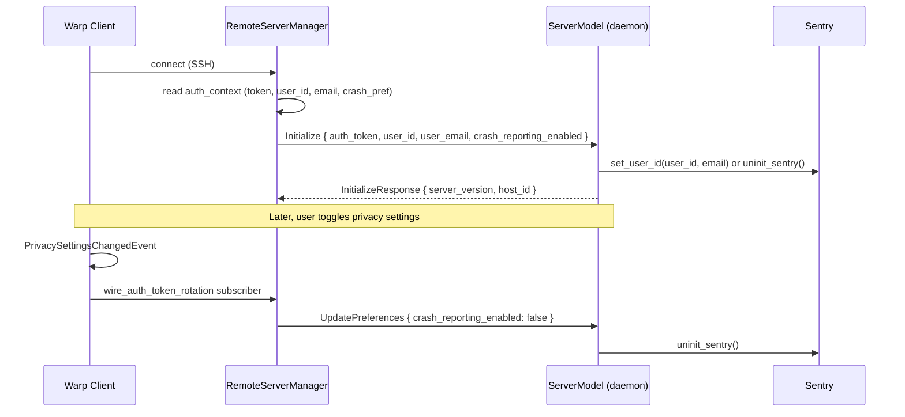

# Daemon Sentry Initialization

## Context

Warp's remote server daemon (`remote-server-daemon`) is a long-lived headless process on the SSH host that serves remote terminal sessions. Previously it bypassed `run_internal` and `initialize_app` entirely, instead calling a separate `init_common` → `run_daemon_app` path that stood up a minimal headless `AppBuilder` with hand-picked singletons. This meant the daemon missed all initialization that `initialize_app` performs — most critically Sentry crash reporting, but also feature flags, profiling, resource limits, and any future singletons added to `initialize_app`.

The proxy (`remote-server-proxy`) is a thin stdio↔Unix-socket byte bridge. It only needs logging to stderr; it does not need `initialize_app` or crash reporting.

The daemon also had no way to know *who* was using it. Sentry reports from daemon crashes had no user identity, and there was no mechanism to dynamically enable or disable crash reporting when the user toggles their privacy preference on the client.

### Relevant files (before this change)

- `app/src/lib.rs` — `init_common()` duplicated early setup; `run_internal()` called `init_common` then `initialize_app`; daemon/proxy both called `init_common` directly and never reached `run_internal`.
- `app/src/remote_server/mod.rs` — `run_daemon_app()` built a bespoke headless `AppBuilder` with a subset of singletons.
- `app/src/remote_server/unix/mod.rs` — `run_daemon()` bound the socket, then called `run_daemon_app`.
- `app/src/remote_server/server_model.rs` — `handle_initialize` only stored the auth token.
- `crates/remote_server/src/auth.rs` — `RemoteServerAuthContext` carried only auth token + identity key closures.
- `crates/remote_server/proto/remote_server.proto` — `Initialize` had only `auth_token`.

## Proposed changes

### 1. Unify daemon startup through `run_internal`

Delete `init_common` and inline its steps at the top of `run_internal`. Delete `run_daemon_app`. The daemon now enters through:

```
run_daemon(identity_key) → run_internal(LaunchMode::RemoteServerDaemon { identity_key })
  → early init (logging, feature flags, profiling, resource limits, TLS)
  → AppBuilder::new_headless + initialize_app (full singleton chain including Sentry)
  → launch() which matches LaunchMode::RemoteServerDaemon and calls launch_daemon()
```

`LaunchMode::RemoteServerDaemon` becomes a struct variant carrying the `identity_key: String` so `launch()` can pass it to socket binding. All existing match arms update to `RemoteServerDaemon { .. }`.

`launch_daemon()` (new function in `unix/mod.rs`) binds the Unix socket, writes the PID file, spawns the accept loop, and registers `ServerModel` as a singleton — the same work `run_daemon_app` did, minus the `AppBuilder` and generic singletons that `initialize_app` now provides.

Key files:
- `app/src/lib.rs (375-380)` — `LaunchMode::RemoteServerDaemon { identity_key }` struct variant
- `app/src/lib.rs (642-658)` — proxy gets inline logging-only init; daemon calls `run_internal`
- `app/src/lib.rs (2379-2393)` — `launch()` arm calls `remote_server::unix::launch_daemon()`
- `app/src/remote_server/mod.rs` — `run_daemon_app` deleted
- `app/src/remote_server/unix/mod.rs (23-40)` — `run_daemon` calls `run_internal`; `launch_daemon` is the new socket-binding entrypoint

The proxy keeps a minimal inline init (logging to stderr only) and never calls `run_internal`.

### 2. Pipe user identity and crash-reporting preference to the daemon

Extend the protocol so the client sends user identity and crash-reporting preference to the daemon during the `Initialize` handshake, and can update the preference dynamically afterward.

**Proto** (`crates/remote_server/proto/remote_server.proto`):
- `Initialize` gains `user_id`, `user_email`, `crash_reporting_enabled` fields.
- New `UpdatePreferences` message with `crash_reporting_enabled`, added to `ClientMessage.oneof`.

**Auth context** (`crates/remote_server/src/auth.rs`):
- `RemoteServerAuthContext` gains three new closures: `get_user_id`, `get_user_email`, `get_crash_reporting_enabled`.
- `app/src/remote_server/auth_context.rs` — `server_api_auth_context()` sources them from `AuthState` and a shared `Arc<RwLock<bool>>` for the crash reporting flag.
- `app/src/terminal/writeable_pty/remote_server_controller.rs` — reads initial value from `PrivacySettings`.

**Client** (`crates/remote_server/src/client/mod.rs`):
- `initialize()` accepts `user_id`, `user_email`, `crash_reporting_enabled` and sends them in the `Initialize` message.
- New `update_preferences()` fire-and-forget method sends `UpdatePreferences`.

**Manager** (`crates/remote_server/src/manager.rs`):
- `run_connect_and_handshake` reads user info from auth context and passes to `client.initialize()`.
- New `all_connected_clients()` iterator for broadcasting preference changes.

**Daemon handlers** (`app/src/remote_server/server_model.rs`):
- `handle_initialize` — after storing the auth token, calls `crash_reporting::set_user_id()` or `crash_reporting::uninit_sentry()` depending on `crash_reporting_enabled`.
- New `handle_update_preferences` — dynamically enables/disables Sentry. Uses new `crash_reporting::is_initialized()` to avoid double-init.
- `apply_initialize_auth` extracted for testability without `ModelContext`.

**Event wiring** (`app/src/remote_server/mod.rs`):
- `wire_auth_token_rotation` now also subscribes to `PrivacySettingsChangedEvent`. When the user toggles crash reporting, it calls `update_preferences()` on every connected daemon via `all_connected_clients()`.

**Crash reporting** (`app/src/crash_reporting/mod.rs`):
- New `is_initialized()` helper checks the `RUST_SENTRY_CLIENT_GUARD` state.

### Data flow



## Testing and validation

### Unit tests (updated)
- `server_model_tests.rs` — tests use `apply_initialize_auth` instead of `handle_initialize` to avoid needing `ModelContext`. All four existing auth-token tests updated with new `Initialize` fields.
- `client_tests.rs` — `initialize()` calls updated with new params (`user_id`, `user_email`, `crash_reporting_enabled`).
- `protocol_tests.rs` — round-trip and request-ID extraction tests include new `Initialize` fields.
- `ssh_transport.rs` — `RemoteServerAuthContext::new` calls updated with three new closure args.

### E2E validation (manual, completed)
1. Deployed daemon with a temporary `panic!("TEST DAEMON CRASH")` in `handle_initialize` after Sentry setup.
2. Connected from Warp client → daemon crashed → verified event appeared in Sentry (`warp-client-local` project) within seconds.
3. Confirmed Sentry event contains:
   - Correct user ID (`evlWdsVMvZYciWUIi6ZkKwVBrEH2`) piped from the client.
   - `mechanism: panic`, `level: fatal`.
   - `warp.client_type: warp-cli` tag.
   - Host/OS metadata (`Linux`, `x86_64`).
4. Removed test panic before merging.

## Risks and mitigations

- **Daemon now runs the full `initialize_app` singleton chain.** This is heavier than the old bespoke init, but the daemon is already a long-lived process and the overhead is one-time at startup. Any singleton that shouldn't run headless should already be gated by `LaunchMode` checks (several exist, e.g. GUI window creation, settings UI).
- **User identity is piped in plaintext over the Unix socket.** This is local-only (client↔daemon on the same host), same trust boundary as the auth token that was already sent.
- **`UpdatePreferences` is fire-and-forget.** If delivery fails (daemon disconnected), the daemon will pick up the current preference on next `Initialize`. No ack/retry needed.
