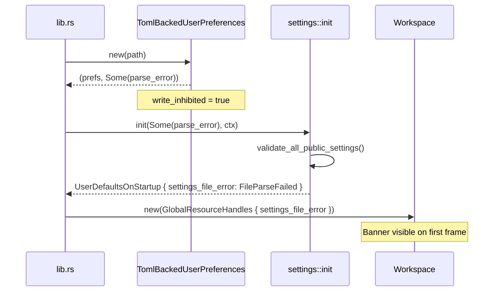
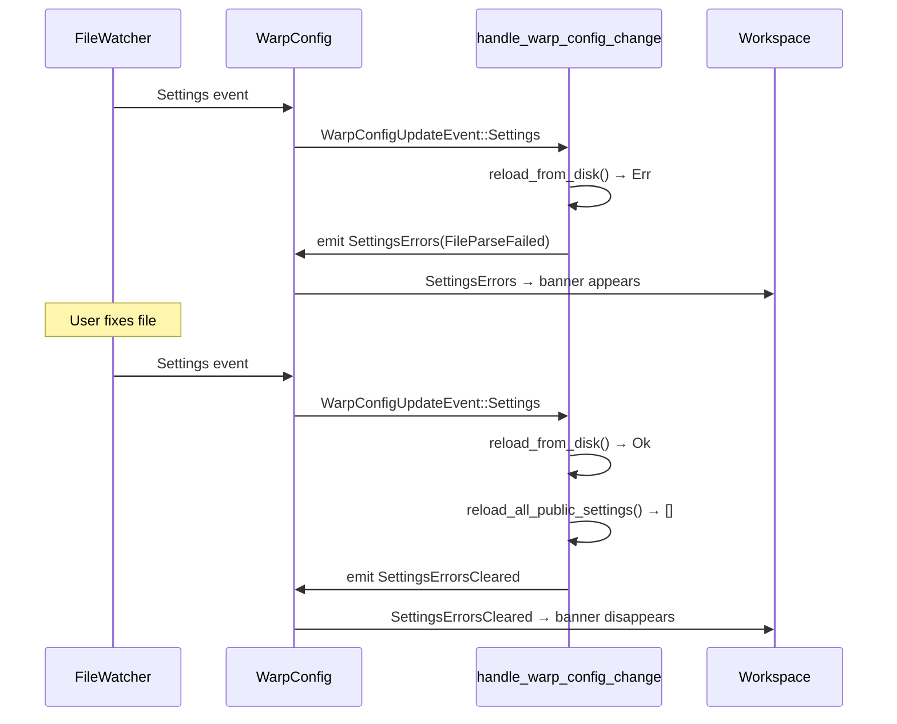

# Settings File Error Banner — Tech Spec

## Problem

`settings.toml` errors are invisible to the user. When the file has a TOML syntax error, the app silently falls back to defaults. When individual values are the wrong type, they silently revert to defaults. There is no mechanism to surface these errors to the user or to recover gracefully.

This required two coordinated changes:
1. **Startup recovery** (prerequisite PR) — Always create `TomlBackedUserPreferences` even on parse failure, so the hot-reload watcher is wired up and can recover when the file is fixed.
2. **Error banner** — Capture errors from both startup and hot-reload paths, propagate them to the workspace, and render a dismissible warning banner.

## Relevant code

- `crates/warpui_extras/src/user_preferences/toml_backed.rs` — TOML preferences backend (`new()`, `reload_from_disk()`)
- `app/src/settings/init.rs` — `init_public_user_preferences()`, `init()`, `handle_warp_config_change()`
- `app/src/settings/mod.rs` — `SettingsFileError` enum
- `crates/settings/src/manager.rs` — `SettingsManager::reload_all_public_settings()`, `validate_all_public_settings()`
- `app/src/user_config/mod.rs` — `WarpConfigUpdateEvent::SettingsErrors` / `SettingsErrorsCleared`
- `app/src/workspace/view.rs` — `WorkspaceBanner::InvalidSettings`, `render_settings_error_banner()`, `subscribe_to_settings_errors()`
- `app/src/workspace/action.rs` — `WorkspaceAction::OpenSettingsFile`
- `app/src/global_resource_handles.rs` — `settings_file_error` field for startup propagation
- `app/src/lib.rs` — threading startup parse error through `initialize_app()`

## Current state

### Before these changes

- `TomlBackedUserPreferences::new()` returned `Result<Self, Error>`. On parse failure, `init_public_user_preferences()` fell back to `InMemoryPreferences`.
- `InMemoryPreferences::is_settings_file()` returned `false`, so the hot-reload watcher subscription in `init()` was never set up. The user was stuck on defaults permanently.
- `reload_all_public_settings()` returned `()`, logging per-setting failures but not collecting them.
- No mechanism existed to surface settings errors to the user.

### After these changes

- `TomlBackedUserPreferences::new()` returns `(Self, Option<Error>)`. It always succeeds, starting with an empty document on parse failure.
- `reload_all_public_settings()` returns `Vec<String>` of failed storage keys.
- `validate_all_public_settings()` provides read-only startup validation.
- Errors are propagated via `WarpConfigUpdateEvent` to the workspace banner system.

## Proposed changes (as implemented)

### Prerequisite: Startup fallback (`TomlBackedUserPreferences::new()`)

Changed `new()` to `(Self, Option<Error>)`. On parse failure, starts with `DocumentMut::new()` and returns the error separately. The caller always gets a working `TomlBackedUserPreferences` that can recover via `reload_from_disk()`. (Separate PR.)

### Settings error banner

#### Error type

```rust
// app/src/settings/mod.rs
pub enum SettingsFileError {
    FileParseFailed(String),
    InvalidSettings(Vec<String>),
}
```

#### Error capture — hot-reload path

`handle_warp_config_change()` in `app/src/settings/init.rs`:
- On `reload_from_disk()` failure → emits `WarpConfigUpdateEvent::SettingsErrors(FileParseFailed(...))`
- On success → calls `reload_all_public_settings()`. If failed keys returned → emits `SettingsErrors(InvalidSettings(...))`. If empty → emits `SettingsErrorsCleared`.

#### Error capture — startup path

- `init_public_user_preferences()` returns `(Model, Option<user_preferences::Error>)`. The parse error flows through `lib.rs` → `initialize_app()` → `settings::init()`, which stringifies it when wrapping into `SettingsFileError::FileParseFailed`.
- `validate_all_public_settings()` re-reads each public setting from preferences and attempts deserialization via `equals_fn`, returning failed keys.
- Both errors are combined into `SettingsFileError` and stored in `UserDefaultsOnStartup.settings_file_error`, which flows through `GlobalResourceHandles` to `Workspace::new()`.

#### Event plumbing

Two new `WarpConfigUpdateEvent` variants:
- `SettingsErrors(SettingsFileError)` — emitted when errors are detected
- `SettingsErrorsCleared` — emitted when a reload succeeds with no errors

#### Workspace banner

- `WorkspaceBanner::InvalidSettings` variant added to the enum. Returns `true` from `is_dismissible()`.
- `Workspace` fields: `settings_file_error: Option<SettingsFileError>`, `settings_error_banner_dismissed: bool`.
- `render_settings_error_banner()` produces `WorkspaceBannerFields` with the appropriate message and an "Open settings file" button.
- `subscribe_to_settings_errors()` subscribes to `WarpConfig` model for `SettingsErrors`/`SettingsErrorsCleared` events.
- `WorkspaceAction::OpenSettingsFile` opens `settings.toml` in a code editor pane via `add_tab_for_code_file()`.

## End-to-end flow

### Startup with broken file



### Hot-reload with error → fix



## Risks and mitigations

- **Watcher reliability**: The filesystem watcher (notify) may not reliably detect file creation on all platforms. Mitigation: for file *modification* (the common case when the user edits their file), detection is reliable. The startup path catches errors independently of the watcher.
- **Validate via equals_fn**: `validate_all_public_settings` uses the `equals_fn` closure (which round-trips through `serde_json::from_str`) rather than the `load_fn`. This is intentional — it's a read-only check that doesn't modify in-memory state. Risk: if a setting has a custom `file_deserialize` that accepts values the `equals_fn` rejects, or vice versa, there could be false positives/negatives. Mitigation: the `equals_fn` path matches the `load_fn` path for standard serde-based settings.

## Testing and validation

### Unit tests (`crates/settings/src/mod_tests.rs`)
- `test_reload_returns_failed_keys_for_invalid_values` — reload with bad value returns the key
- `test_reload_returns_empty_vec_on_success` — reload with valid values returns empty
- `test_validate_detects_invalid_values` — startup validation catches bad values
- `test_validate_returns_empty_when_all_valid` — startup validation passes for good values

### Unit tests (`crates/warpui_extras/src/user_preferences/toml_backed_tests.rs`)
- `test_new_with_invalid_toml_returns_error_and_recovers_on_reload` — parse failure → recovery

### Integration tests (`crates/integration/src/test/settings_file_errors.rs`)
- `test_settings_error_banner_on_startup_with_invalid_toml` — startup banner for broken file
- `test_settings_error_banner_on_startup_with_invalid_value` — startup banner for bad value
- `test_settings_error_banner_on_reload_with_invalid_toml` — reload banner + auto-clear on fix
- `test_settings_error_banner_on_reload_with_invalid_value` — reload banner for bad value
