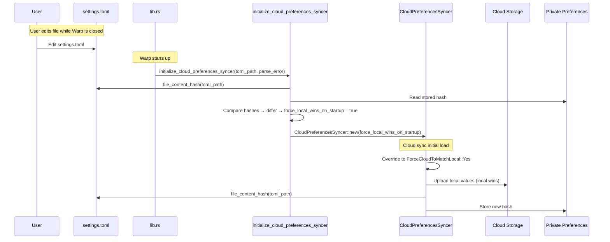

# Settings File Offline Edit Detection — Tech Spec

Linear: QUALITY-474

## Problem

`CloudPreferencesSyncer::handle_initial_load` uses `ForceCloudToMatchLocal::No` on normal startup, meaning cloud values overwrite local values for all synced keys. This is incorrect when the user has made local changes (file edit while Warp was closed, or UI change while offline) that haven't been synced to cloud.

## Relevant Code

- `app/src/settings/cloud_preferences_syncer.rs` — `CloudPreferencesSyncer`, `handle_initial_load`, `maybe_sync_local_prefs_to_cloud`, `ForceCloudToMatchLocal`
- `app/src/settings/init.rs` — `init()`, `init_public_user_preferences()`, `UserDefaultsOnStartup`
- `app/src/lib.rs (930-960)` — `initialize_app`, where `settings::init` is called and `UserDefaultsOnStartup` is consumed
- `crates/warpui_extras/src/user_preferences/toml_backed.rs` — `TomlBackedUserPreferences`, `flush()`, `reload_from_disk()`
- `crates/settings/src/manager.rs` — `SettingsManager`

## Current State

Cloud sync runs after startup via an async chain: `handle_user_fetched` → `sync()` → waits for `initial_load_complete()` → `handle_initial_load(ForceCloudToMatchLocal::No)`. For every synced key present in cloud, `maybe_sync_cloud_pref_to_local` overwrites the local value via `update_setting_with_storage_key(..., from_cloud_sync: true)`, which writes through to the TOML file.

The `ForceCloudToMatchLocal::Yes` path already exists — it skips cloud→local and forces local→cloud instead. It's currently only triggered when the user manually re-enables settings sync.

Already implemented on the `daniel/inhibit-writes-mode` branch:
- Flush suppression when TOML file fails to parse (broken file preserved on disk)
- Settings error banner with workspace-level UI
- `SettingsFileError` type, `WarpConfigUpdateEvent::SettingsErrors`/`SettingsErrorsCleared`
- `init_public_user_preferences()` returns `(Model, Option<String>)` with parse error

## Proposed Changes

### 1. Hash computation on TomlBackedUserPreferences

`crates/warpui_extras/src/user_preferences/toml_backed.rs`:

```rust
/// Hashes the settings file content on disk.
///
/// Returns `None` if the file is missing, empty/whitespace-only, or
/// unreadable. These cases are all treated as "no local state" rather
/// than "local state that should win" — see the startup comparison
/// logic in `init.rs` for the rationale.
///
/// Uses SHA-256 so that persisted hashes are stable across Rust
/// toolchain upgrades and crate version bumps (unlike `SipHasher`
/// or `DefaultHasher`, whose output is not guaranteed to be stable).
pub fn file_content_hash(file_path: &Path) -> Option<String> {
    use sha2::{Digest, Sha256};
    let contents = match std::fs::read_to_string(file_path) {
        Ok(c) => c,
        Err(err) if err.kind() == std::io::ErrorKind::NotFound => return None,
        Err(err) => {
            log::warn!(
                "Failed to read settings file at {}: {err}",
                file_path.display()
            );
            return None;
        }
    };
    // An empty/whitespace-only file is semantically equivalent to a
    // missing file — no settings are defined. Treating them the same
    // way avoids wiping cloud with defaults if the user empties the
    // file to reset.
    if contents.trim().is_empty() {
        return None;
    }
    let digest = Sha256::digest(contents.as_bytes());
    Some(format!("{digest:x}"))
}
```

`sha2` is already a workspace dependency, so no new dependency is required.

### 2. Single entry point for syncer construction

The hash comparison and the storage-key constant live in `cloud_preferences_syncer.rs` alongside the syncer they configure, rather than in `init.rs`. This keeps the syncer's startup decision cohesive with the syncer module and gives both production callers and tests a single seam to exercise — see the Test Infrastructure subsection of Testing and Validation for why this matters.

```rust
pub(super) const SETTINGS_FILE_LAST_SYNCED_HASH_KEY: &str =
    "SettingsFileLastSyncedHash";

/// Constructs the cloud preferences syncer, computing the
/// `force_local_wins_on_startup` flag by comparing the current
/// settings file hash against the last-synced hash stored in private
/// preferences. This is the only entry point used to construct the
/// syncer at app startup; production code in `lib.rs` and end-to-end
/// tests both call it so they exercise the same code path.
pub fn initialize_cloud_preferences_syncer(
    toml_file_path: &Path,
    startup_toml_parse_error: Option<&str>,
    ctx: &mut ModelContext<CloudPreferencesSyncer>,
) -> CloudPreferencesSyncer {
    let current_hash = TomlBackedUserPreferences::file_content_hash(toml_file_path);
    let stored_hash = ctx
        .private_user_preferences()
        .read_value(SETTINGS_FILE_LAST_SYNCED_HASH_KEY)
        .unwrap_or_default();

    let file_has_unsynced_changes = match (current_hash, stored_hash) {
        // File present, stored hash present: trust the comparison.
        (Some(current), Some(stored)) => current != stored,
        // File present, no stored hash (first launch, fresh install,
        // or the stored hash was cleared): cloud wins, consistent
        // with today's behavior.
        (Some(_), None) => false,
        // File missing/empty, stored hash present (user deleted or
        // emptied the file): cloud wins. If we treated this as
        // "local differs" we'd upload defaults and wipe the user's
        // cloud settings — exactly what they likely don't want.
        (None, Some(_)) => false,
        // File missing/empty, no stored hash (fresh install with no
        // file yet): cloud wins.
        (None, None) => false,
    };

    // Broken-file guard: when the file can't be parsed, there are no
    // meaningful local values to preserve. Cloud sync restores
    // settings in memory while flush suppression protects the broken
    // file on disk.
    let force_local_wins_on_startup =
        file_has_unsynced_changes && startup_toml_parse_error.is_none();

    CloudPreferencesSyncer::new(force_local_wins_on_startup, ctx)
}
```

`init()` does not need to compute the hash itself — it continues to populate `settings_file_error` on `UserDefaultsOnStartup` (already implemented). `lib.rs` extracts the file-parse error from that field and passes it through to `initialize_cloud_preferences_syncer` so the broken-file guard still applies.

### 3. Plumb the flag through CloudPreferencesSyncer

`app/src/settings/cloud_preferences_syncer.rs`:

The syncer shouldn't know *why* local is considered authoritative — only that it should treat local as authoritative on the first initial load. Pass the signal through the constructor so future triggers (crash-recovery marker, offline settings queue, etc.) can be OR'd into the same bool without touching the syncer.

The constructor also takes a `toml_file_path: PathBuf` so that `update_stored_settings_hash` can compute the hash without relying on a global function.

```rust
pub struct CloudPreferencesSyncer {
    // ... existing fields ...
    force_local_wins_on_startup: bool,
    toml_file_path: PathBuf,
}
impl CloudPreferencesSyncer {
    pub fn new(
        force_local_wins_on_startup: bool,
        toml_file_path: PathBuf,
        ctx: &mut ModelContext<Self>,
    ) -> Self {
        let mut me = Self::new_internal(ctx, Arc::new(DefaultClientIdProvider), toml_file_path);
        me.force_local_wins_on_startup = force_local_wins_on_startup;
        me.retry_failed_settings(ctx);
        me
    }
}
```

In `handle_initial_load`, override `force_cloud_to_match_local` only on the first invocation:

```rust
let force_cloud_to_match_local =
    if !self.has_completed_initial_load && self.force_local_wins_on_startup {
        ForceCloudToMatchLocal::Yes
    } else {
        force_cloud_to_match_local
    };
```

The `!self.has_completed_initial_load` guard makes this a genuine one-time override — robust against any future code path that calls `sync()` multiple times.

Two additional guards in the syncer:

- **Subscription guard**: The `UpdateManagerEvent::CloudPreferencesUpdated` subscription handler also checks `!has_completed_initial_load && force_local_wins_on_startup` and returns early. Without this, `mock_initial_load` synchronously emits cloud preference events that would overwrite local values before `handle_initial_load`'s future-based override runs.
- **Key ordering in `handle_initial_load`**: The `keys_to_sync` list is sorted so that settings with `RespectUserSyncSetting::No` are processed first. This ensures `IsSettingsSyncEnabled` is restored from cloud before other settings check `settings_sync_enabled`. Without this, `HashMap` iteration order could leave sync disabled when the file is deleted or on a fresh device, causing other settings to be silently skipped.

In `lib.rs`, call the entry point from Section 2 with the file path and the file-parse error already available on `UserDefaultsOnStartup`:

```rust
let toml_path = settings::user_preferences_toml_file_path();
let parse_error = user_defaults_on_startup
    .settings_file_error
    .as_ref()
    .and_then(|err| match err {
        SettingsFileError::FileParseFailed(msg) => Some(msg.clone()),
        SettingsFileError::InvalidSettings(_) => None,
    });
ctx.add_singleton_model(move |ctx| {
    initialize_cloud_preferences_syncer(
        &toml_path,
        parse_error.as_deref(),
        ctx,
    )
});
```

### 4. Update the stored hash after sync reconciliation

Add a helper in `cloud_preferences_syncer.rs`:

```rust
fn update_stored_settings_hash(&self, ctx: &mut ModelContext<Self>) {
    let Some(hash) = TomlBackedUserPreferences::file_content_hash(&self.toml_file_path)
    else {
        return;
    };
    if let Err(err) = ctx
        .private_user_preferences()
        .write_value(SETTINGS_FILE_LAST_SYNCED_HASH_KEY, hash)
    {
        log::warn!("Failed to persist settings file hash after sync: {err}");
    }
}
```

This is called from two sites:

1. **`handle_initial_load`** — synchronously at the end, after `InitialLoadCompleted` is emitted. At this point reconciliation is complete.
2. **`handle_sync_queue_event`** — a subscription on `SyncQueue` events that fires when a cloud preference is successfully created or updated on the server. This replaces the earlier approach of calling `update_stored_settings_hash` synchronously at the end of `maybe_sync_local_prefs_to_cloud`, which was incorrect: the upload is async (enqueued to the `SyncQueue`), so the hash was being recorded before the server had actually accepted the change. If the user was offline, the upload would silently fail but the hash would already reflect the new file content, causing the next startup to miss the divergence.

The `SyncQueue` subscription checks whether the successfully synced object is actually a cloud preference (not another `GenericStringObject` type like env var collections or MCP servers) by looking up the `server_id` in `CloudModel::get_all_cloud_preferences_by_storage_key()`.

**Broken-file interaction**: when flush is suppressed, `file_content_hash` reads the broken file from disk and stores *its* hash. On the next startup, if the file is still broken, hashes match → cloud wins (the broken-file guard still applies). If the user fixed the file, hashes differ → local wins with the fixed content. Both are correct.

**Missing-file interaction**: if the file is missing after sync (edge case — normally sync would have written cloud values to disk), `file_content_hash` returns `None` and the helper is a no-op. On the next startup, `(None, stored_hash_from_previous_session)` → cloud wins, which triggers recovery.

## End-to-End Flow



## Risks and Mitigations

- **Race between flush suppression and hash storage**: When the file is broken on startup, flush is suppressed. The hash stored after initial sync is the broken file's hash (read from disk). This is correct: if the file is later fixed, the hash will differ on next startup, triggering local-wins with the fixed content.
- **Two devices with offline changes**: The last device to sync wins. This is a known limitation documented in the product spec as a non-goal.

## Testing and Validation

### Test infrastructure

The new end-to-end tests in this spec rely on two pieces of infrastructure introduced alongside the production changes. Existing settings sync tests in `app/src/settings/cloud_preferences_syncer_tests.rs` continue to work unchanged and do not need to be migrated; new settings sync tests should use this infrastructure.

**`FakeObjectClient`** (new, in `app/src/server/cloud_objects/fake_object_client.rs`): a stateful `impl ObjectClient` backed by an `Arc<Mutex<FakeCloudState>>`. Replaces per-method scripted `MockObjectClient` expectations for tests that want to assert on round-trip behavior rather than on which methods got called. Key properties:

- Pass-through `client_id` semantics so tests no longer need to pre-allocate ids via `TestClientIdProvider`.
- `bulk_create_generic_string_objects` and `update_generic_string_object` write into the store; `fetch_changed_objects` returns whatever is currently in the store. A test can write a setting locally, trigger a refresh, and observe what the cloud now holds.
- Helper methods `seed_preference(storage_key, value_json, platform)` and `cloud_value(storage_key, platform)` use the same `CloudPreferenceModel` serialization the real syncer uses, so format drift is caught at compile time rather than via hand-rolled JSON literals. `snapshot_as_initial_load_response()` builds an `InitialLoadResponse` from the current fake state for use with `UpdateManager::mock_initial_load`.
- Only the `ObjectClient` methods the syncer actually calls need real implementations; the rest panic with `unimplemented!()` until a future test needs them.

**`initialize_cloud_preferences_syncer` seam** (Section 2): the single function that both production and tests call to construct the syncer with the hash check applied. Without this seam, end-to-end tests would have to either call all of `init()` (too many side effects) or hard-code `force_local_wins_on_startup`, neither of which actually exercises the hash comparison logic.

End-to-end tests build on top of these two pieces by:

1. Creating a `tempfile::TempDir` and writing a real `settings.toml` into it.
2. Registering a `TomlBackedUserPreferences` pointing at that temp file as the public preferences singleton, replacing the `#[cfg(test)]` `InMemoryPreferences` shortcut in `init_public_user_preferences`.
3. Seeding `SETTINGS_FILE_LAST_SYNCED_HASH_KEY` in the test's `InMemoryPreferences`-backed private preferences to simulate the previously-synced state.
4. Wiring a `FakeObjectClient` through `create_update_manager_struct` and seeding any cloud-side starting state via `seed_setting`.
5. Calling `initialize_cloud_preferences_syncer(&toml_path, parse_error, ctx)` and asserting on `cloud.cloud_value::<S>(...)`, the on-disk file contents, and the new stored hash.

### Unit tests

- `file_content_hash` returns `None` for missing files.
- `file_content_hash` returns `None` for empty / whitespace-only files.
- `file_content_hash` returns identical hashes for identical content and different hashes for different content.

### End-to-end tests

Each of these is a variation on the scaffolding above (different file contents, stored hash, parse error, and seeded cloud values):

- Startup with current file hash matching stored hash → cloud wins; seeded cloud value is preserved in local state.
- Startup with file hash differing from stored hash (file parsed OK) → local wins; the seeded cloud value is overwritten with the local value, the on-disk file is unchanged, and the stored hash now matches the current file hash.
- Startup with file hash differing but file broken (`startup_toml_parse_error = Some(...)`) → cloud wins (broken-file guard); seeded cloud value is preserved.
- Startup with file missing and stored hash present → cloud wins; seeded cloud value is preserved (no wipe of cloud).
- Startup with file empty and stored hash present → cloud wins; seeded cloud value is preserved (no wipe of cloud).
- First launch with no stored hash → cloud wins.
- After a UI-initiated setting change and the resulting upload, the stored hash is updated to match the current file hash (covers Section 4's `SyncQueue` event subscription).
- The first-load override is one-shot: a second `sync()` after `has_completed_initial_load = true` does not force local-wins again.
- **Offline UI change regression test**: Setting is changed while the `SyncQueue` is stopped (simulating offline). The stored hash must NOT update while the upload is pending. After restarting the queue (simulating coming back online) and draining sync queue futures, the stored hash updates to match the new file.

## Follow-ups

- Per-key conflict detection for more granular merge behavior (deferred as non-goal).
- User-facing prompt for conflict resolution (deferred as non-goal).
