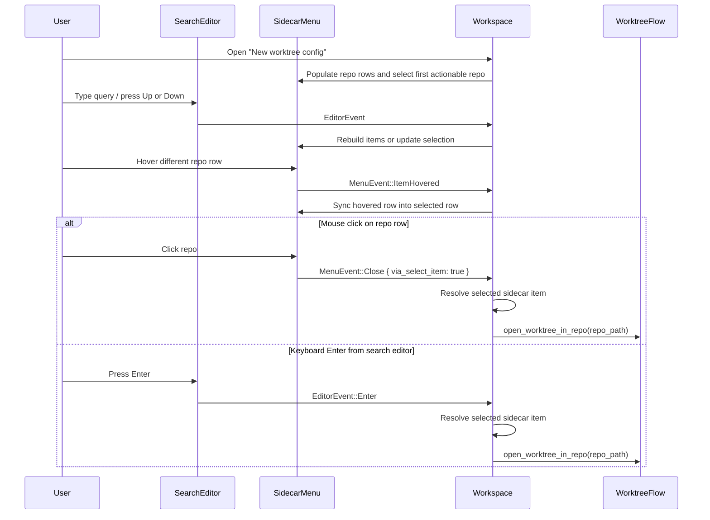

# APP-3830: Worktree Sidecar Selection Semantics — Tech Spec

Related product spec: `specs/moirahuang/APP-3830/PRODUCT.md`
Related prior feature spec: `specs/moirahuang/APP-3743/TECH.md`

## Problem

The worktree sidecar sits in an awkward spot between generic menu behavior and `Workspace`-owned worktree creation.

Before this change:

- repo rows in the sidecar relied on direct typed-action dispatch from the sidecar overlay
- the sidecar tracked `selected_row_index` and `hovered_row_index` separately
- keyboard initialization selected the first repo row, but mouse hover only updated `hovered_row_index`
- `MenuEvent::ItemSelected` represented selection movement, not execution

That combination caused two classes of bugs:

1. execution could fail because the sidecar overlay dispatched `WorkspaceAction::OpenWorktreeInRepo` from a context where no view handled it
2. the visually hovered repo could differ from the underlying actionable selection, so click and keyboard confirmation could resolve different rows

## Relevant code

- `app/src/menu.rs (52-125)` — generic `Menu<A>` state, including the new `dispatch_item_actions` flag
- `app/src/menu.rs (1253-1451)` — `MenuItem::render` plumbing that now threads `dispatch_item_actions` through click handling
- `app/src/menu.rs (1747-1989)` — `Menu::new()` default behavior and `without_item_action_dispatch()`
- `app/src/menu.rs (2208-2359)` — `SubMenu::handle_action()` and `TypedActionView for Menu<A>`
- `app/src/workspace/view.rs (715-746)` — `WorkspaceMenuHandles` and `NewSessionSidecarSelection`
- `app/src/workspace/view.rs (978-1071)` — worktree sidecar selection helpers, keyboard confirm path, and hover-to-selection sync
- `app/src/workspace/view.rs (1588-1638)` — sidecar menu construction in `build_menus()`
- `app/src/workspace/view.rs (7430-7484)` — `handle_new_session_sidecar_event()`
- `app/src/workspace/view.rs (7489-7694)` — worktree sidecar item construction, search row, repo rows, and pinned footer
- `app/src/workspace/view.rs (8124-8180)` — `open_worktree_in_repo()`
- `app/src/workspace/view_test.rs (258-389)` — sidecar hover precedence and execution-path regression tests

## Current state

### Menu dispatch model

`Menu<A>` historically assumed that clicking or pressing `Enter` on a row should dispatch the row's typed action directly from the menu view. That works for menus whose handlers live in the same responder chain, but the worktree sidecar is an overlay whose repo-opening behavior belongs to `Workspace`.

### Sidecar state model

The sidecar menu stores:

- `selected_row_index` for keyboard-driven selection
- `hovered_row_index` for mouse hover

The search field requires an initial keyboard selection so `Up`, `Down`, and `Enter` can operate from the focused editor. But once the mouse moves over a different repo row, the hovered row became visually prominent without necessarily becoming the actionable selection.

### Why not execute from `ItemSelected`

`MenuEvent::ItemSelected` is emitted whenever the menu selection changes, including:

- arrow-key movement
- programmatic selection initialization
- click-driven row selection before close

If `Workspace` executed repo opening on every `ItemSelected`, arrow-key navigation would incorrectly open worktrees while the user was only moving through the list.

## Proposed changes

### 1. Add an opt-in non-dispatch mode to `Menu`

Extend `Menu<A>` with a `dispatch_item_actions: bool` flag that defaults to `true`.

Add:

- `Menu::without_item_action_dispatch()`

When disabled:

- click still dispatches `MenuAction::Select(...)`
- click still dispatches `MenuAction::Close(true)`
- `Enter` still emits `ItemSelected` and `Close(true)`
- the menu does not dispatch the row's typed action directly

This keeps existing menus unchanged while giving overlay-style menus a way to separate "selection changed" from "execute action."

### 2. Make the sidecar menu local to `Workspace`

Change the sidecar from `Menu<WorkspaceAction>` to `Menu<NewSessionSidecarSelection>`.

`NewSessionSidecarSelection` carries only local sidecar intent:

- `OpenWorktreeRepo { repo_path }`
- Windows-only terminal variants for the Terminal sidecar path

This removes the repo-row dependency on responder-chain dispatch and makes `Workspace` the sole owner of repo execution.

### 3. Keep execution in `Workspace`

Add helper methods on `Workspace`:

- `selected_new_session_sidecar_selection()`
- `execute_new_session_sidecar_selection()`
- `confirm_worktree_sidecar_selection()`

Execution semantics become:

- mouse click path: resolve the selected sidecar item during `MenuEvent::Close { via_select_item: true }`
- keyboard path from the search editor: `confirm_worktree_sidecar_selection()` resolves and executes directly in `Workspace`

This preserves keyboard behavior without relying on generic menu `Enter` execution.

### 4. Make hover update actionable selection

Add `sync_new_session_sidecar_selection_to_hover()`.

On `MenuEvent::ItemHovered`, `Workspace`:

1. reads `hovered_index()`
2. checks whether the hovered row is actionable via `MenuItem::item_on_select_action()`
3. promotes the hovered row to `selected_index()` if it differs from the current selection

This is intentionally limited to actionable rows so that the search row does not replace repo selection just because the mouse passed over it.

### 5. Preserve footer correctness

The pinned `+ Add new repo` footer still dispatches `WorkspaceAction::OpenWorktreeAddRepoPicker` directly from its click closure.

To avoid executing a stale repo selection on the subsequent close event, `OpenWorktreeAddRepoPicker` first calls `close_new_session_dropdown_menu(ctx)`, which clears sidecar selection state before opening the folder picker.

### 6. Keep config creation out of the routing fix

`open_worktree_in_repo()` and `ensure_default_worktree_config()` remain the execution endpoint for the worktree flow. This PR does not change default-config semantics; it only makes sure the correct repo selection reliably reaches that endpoint.

The logging added around default-config creation and worktree opening improves diagnosis when failures are due to config IO or parsing rather than sidecar routing.

## End-to-end flow

## Risks and mitigations

### Risk: generic menu behavior changes regress unrelated menus

Mitigation:

- `dispatch_item_actions` defaults to `true`
- only the new-session sidecar opts into `without_item_action_dispatch()`

### Risk: hover accidentally selects non-action rows

Mitigation:

- hover-to-selection sync only runs when `MenuItem::item_on_select_action()` is present
- the search row remains non-actionable

### Risk: footer clicks execute stale repo state

Mitigation:

- `OpenWorktreeAddRepoPicker` clears the dropdown and sidecar state before opening the folder picker

### Risk: mouse and keyboard paths diverge again

Mitigation:

- both paths now resolve through the same sidecar-local selection model
- regression tests cover click-like close, keyboard enter, and hover precedence

## Testing and validation

Automated validation should cover:

- `test_worktree_sidecar_hover_takes_precedence_over_selection`
- `test_worktree_sidecar_close_via_select_item_executes_from_workspace`
- `test_worktree_sidecar_search_editor_enter_executes_selection`
- existing search-editor navigation and escape behavior in `test_worktree_sidecar_search_editor_proxies_navigation_and_escape`

Manual validation should verify:

- hovering a repo row updates the active selection highlight
- clicking the hovered row opens the correct repo worktree
- the `OpenWorktreeInRepo ... was dispatched, but no view handled it` warning no longer appears for repo-row selection
- `+ Add new repo` opens only the picker

## Follow-ups

- If more sidecar-style menus need `Workspace`-owned execution, consider formalizing a generic "selection without direct action dispatch" pattern beyond this localized flag.
- If menu execution semantics keep growing more complex, a future cleanup could introduce a distinct executed/confirmed event instead of overloading selection and close events.
