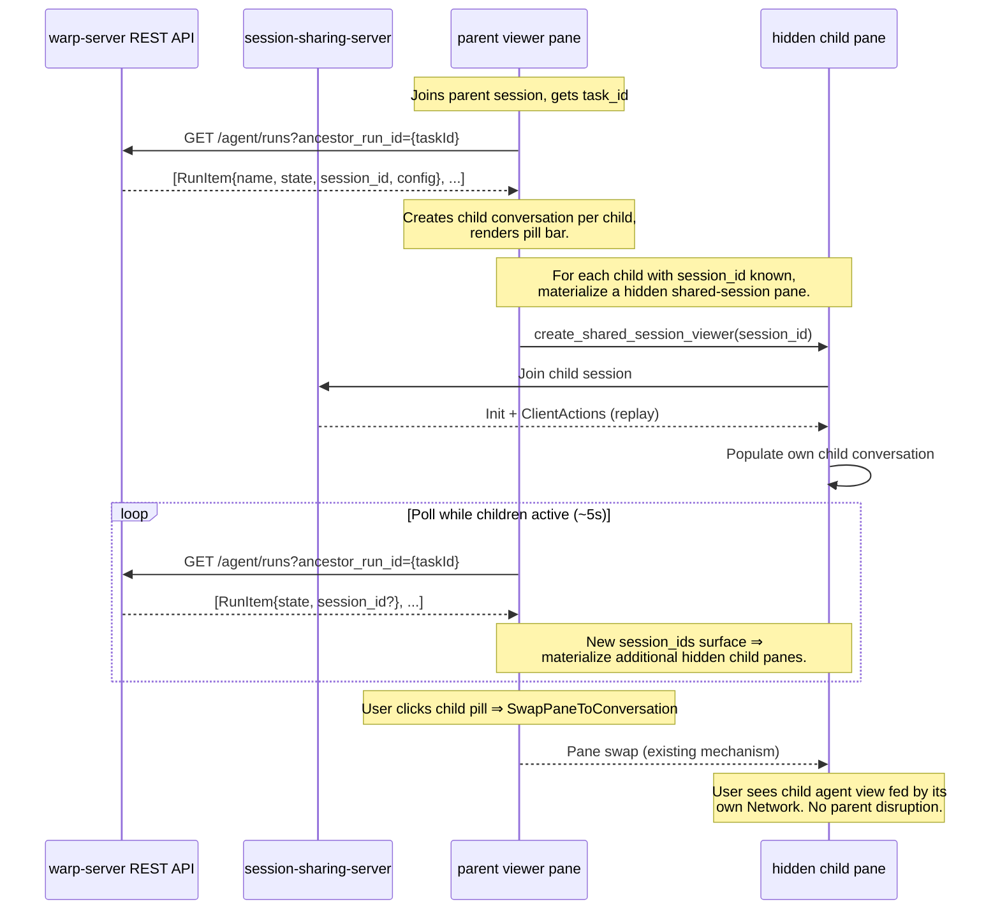

# Orchestration Pill Bar in Shared Session Web Viewer

## Context

See `PRODUCT.md` for user-visible behavior.

### Current pill bar (native, non-shared)

The native pill bar renders in `app/src/ai/blocklist/agent_view/orchestration_pill_bar.rs` as a `View` that reads from `BlocklistAIHistoryModel`. Child conversations are created by `start_new_child_conversation()` in `app/src/ai/blocklist/history_model.rs (398-433)`, which registers the parent-child relationship in a `children_by_parent: HashMap` index. The pill bar queries `child_conversations_of(parent_id)` to build its pill list.

The pill bar is instantiated in `TerminalView` and rendered in `app/src/terminal/view/pane_impl.rs (528-537)` as a secondary header row, gated on `FeatureFlag::OrchestrationPillBar` and `AgentView` and the agent view being fullscreen.

Pill click actions dispatch `TerminalAction::SwitchAgentViewToConversation` (in-place switch), `OpenChildAgentInNewPane`, `OpenChildAgentInNewTab`, or `RevealChildAgent`. The last three depend on `WorkspaceRegistry` and `PaneGroup` APIs that don't exist on WASM.

### Current shared session viewer

The viewer connects via WebSocket to the session-sharing server, receiving `DownstreamMessage::OrderedTerminalEvent` events serialized as JSON. Events are defined in the external `session-sharing-protocol` crate (pinned at rev `3a12b87` in `Cargo.toml:252`).

`AgentResponseEvent` is the only event type carrying agent conversation data. It includes:
- `response_event: String` — base64-encoded protobuf `ResponseEvent` (from `warp_multi_agent_api`)
- `response_initiator: Option<ParticipantId>`
- `forked_from_conversation_token: Option<ServerConversationToken>`

The fork mechanism already supports creating new conversations from a forked token via `link_forked_conversation_token()` in `app/src/ai/blocklist/controller/shared_session.rs (591-622)`. However, it treats forks as sequential continuations, not hierarchical parent-child relationships.

### The gap

Three things are missing:

1. **No child agent discovery in shared sessions.** The viewer has no mechanism to learn that the parent session spawned child agents, what their names/statuses are, or how to access their transcripts. Child tasks exist server-side with their own shared sessions, but the viewer doesn't query for them.

2. **No parent-child conversation registration.** The pill bar renders from `BlocklistAIHistoryModel.child_conversations_of(parent_id)`. In shared sessions, no child conversations are created and no parent-child relationships are registered, so the pill bar has no data.

3. **Pill bar has WASM-incompatible dependencies.** `is_conversation_open_in_other_visible_view()` and `pane_group_id_containing_terminal_view()` in `orchestration_pill_bar.rs (1696-1750)` call `WorkspaceRegistry` and `PaneGroup` APIs that don't exist in the WASM target. The 3-dot menu dispatches pane-split actions unavailable on web.

### Architectural lessons from the V1 attempt

An initial implementation routed all child shared-session traffic through the parent viewer's `TerminalView` + `BlocklistAIController`, opened child `Network`s on the parent's `TerminalManager`, and switched the parent's agent view in place when the user clicked a child pill. That approach is structurally incompatible with the existing app in three ways:

1. `BlocklistAIController` is single-stream. `shared_session_state.current_response_id` is a single `Option<ResponseStreamId>` set in `on_shared_init` and read by `on_shared_client_actions`. `ClientActions` carry no stream identifier, so two Networks feeding the same controller can interleave and route one stream's actions into the other stream's conversation.
2. Conversation ownership is single-view. `BlocklistAIHistoryModel.live_conversation_ids_for_terminal_view` treats each conversation as owned by exactly one view, and `set_active_conversation_id` transfers ownership. Any flow that materializes a hidden child pane (e.g. `restore_missing_child_agent_panes_for_parent`, triggered on `AgentViewControllerEvent::EnteredAgentView` for a parent that has children registered) hands the child conversation to that new pane and the parent view's in-place switch then fails the ownership check.
3. The parent session emits a fresh `Init` for every request the orchestrator processes. Each `Init` runs `set_pending_query_state_for_existing_conversation(parent)`, which calls `try_enter_agent_view(parent)`, which exits any child agent view the user navigated to and re-enters the parent's. This refires `EnteredAgentView`, which refires pane materialization, which then transfers child conversation ownership all over again.

The local-orchestration UI already has a clean answer to all three problems: each child agent gets its own `TerminalView`, `BlocklistAIController`, conversation, and (for remote children) `Network`. The pill bar is a navigation affordance over the pane group, and clicking a pill swaps the visible pane via `SwapPaneToConversation`. Shared-session viewing of an orchestration should mirror that architecture rather than invent a new pattern.

### Relevant files

**Pill bar (shared with native):**
- `app/src/ai/blocklist/agent_view/orchestration_pill_bar.rs` — pill bar View (1994 lines); `pill_specs()` (418-479), `is_conversation_open_in_other_visible_view()` (1696-1724), `pane_group_id_containing_terminal_view()` (1731-1750)
- `app/src/ai/blocklist/history_model.rs (388-450)` — parent-child conversation index (`child_conversations_of`, `start_new_child_conversation`, `set_parent_for_conversation`)
- `app/src/terminal/view/pane_impl.rs (503-543)` — pill bar rendering integration
- `crates/warp_features/src/lib.rs (665-720)` — feature flags (`OrchestrationPillBar`, `Orchestration`)

**Shared session viewer:**
- `app/src/terminal/shared_session/viewer/terminal_manager.rs (730-750)` — task_id extraction from `SessionSourceType::AmbientAgent`
- `app/src/terminal/shared_session/viewer/network.rs` — WebSocket session connection management
- `app/src/terminal/shared_session/viewer/event_loop.rs (275-318)` — AgentResponseEvent processing
- `app/src/ai/blocklist/controller/shared_session.rs (87-240)` — shared session init, `handle_shared_session_response_event()`
- `app/src/ai/blocklist/task_status_sync_model.rs (125-137)` — skips status reporting for `is_viewing_shared_session` conversations
- `app/src/workspace/view/wasm_view.rs (180-196)` — WASM viewer REST API calls via `ServerApiProvider`

**Server REST API (read-only, no changes needed):**
- `warp-server/router/handlers/public_api/agent_webhooks.go (1807-1814)` — `ancestor_run_id` filter validation
- `warp-server/public_api/types/types.gen.go (1579-1658)` — `RunItem` struct with `SessionId`, `SessionLink`, `State`, `Title`, `AgentConfig`, `Artifacts`
- `warp-server/authz/engine.go (556-605)` — `aiTaskPolicies`, ownership-based `ViewAction`

## Design options

Two approaches can deliver orchestration data to the web viewer. They share the same client-side pill bar work (WASM compat, conversation switching) but differ in how orchestration metadata and child transcripts reach the viewer.

### Option A: REST + per-child hidden shared-session pane (recommended for V1)

The viewer queries existing warp-server REST APIs for child metadata and status. Each discovered child gets its own hidden shared-session viewer pane (its own `TerminalView`, `TerminalManager`, and child-session `Network`), reusing the pattern that local orchestration uses for remote child agents. Pill clicks navigate via the existing `SwapPaneToConversation` mechanism. No changes to `session-sharing-protocol` or `warp-proto-apis`.

**How it works:**

1. Viewer joins session → gets `task_id` from `SessionSourceType::AmbientAgent` in the join handshake (already implemented in `terminal_manager.rs:730-750`).
2. Viewer calls `GET /agent/runs?ancestor_run_id={taskId}` → receives list of child `RunItem`s with names, states, agent configs, parent_run_id.
3. For each child, the viewer creates a child conversation in `BlocklistAIHistoryModel` (with `is_viewing_shared_session = true`, `parent_conversation_id` set, `task_id` set) and — once `RunItem.SessionId` is known — materializes a hidden shared-session viewer pane that joins that child's session.
4. Viewer periodically re-fetches `GET /agent/runs?ancestor_run_id={taskId}` to detect new children, surface `session_id`s that weren't ready at first discovery, and update status badges.
5. When user clicks a child pill → `SwapPaneToConversation` swaps the visible pane for the hidden child pane. The user sees that pane's own agent view, fed by its own `Network` against the child's shared session.

**Existing infrastructure:**
- HTTP client (`crates/http_client/`) works on WASM — the web viewer already makes REST calls.
- `GET /agent/runs?ancestor_run_id=` can be polled periodically to get current state for all children in a single request.
- `GET /agent/runs?ancestor_run_id=` returns `RunItem` with `State` (QUEUED, PENDING, CLAIMED, INPROGRESS, SUCCEEDED, FAILED, ERROR, BLOCKED, CANCELLED) which maps directly to `ConversationStatus` pill badges.
- Child tasks have their own shared sessions (`RunItem.SessionId`). The viewer can join child sessions via WebSocket using the same session-sharing protocol as the parent, getting live `AgentResponseEvent` streams that are harness-agnostic.

**Pros:**
- Repos touched: **1-2** (warp client + possibly minor warp-server authz). No `session-sharing-protocol` or `warp-proto-apis` changes.
- Uses existing, tested APIs and client patterns.
- Simpler server-side work.

**Cons:**
- Status badge updates have polling latency (a few seconds between fetches).
- Hidden panes for clicked-but-not-yet-running children are created lazily once a `session_id` is available, so the first click on a freshly queued child may briefly land on an empty agent view until the next poll surfaces the session id and the hidden pane is materialized.
- External link-shared viewers (not on the owning team) cannot access child tasks via REST. Covered by ownership for the common cases (see Layer 1).

### Option B: Streaming through session-sharing protocol

The server forwards child `AgentResponseEvent`s and lifecycle status updates through the parent's shared session WebSocket, enriched with orchestration metadata.

**How it works:**

1. Extend `StreamInit` in `warp-proto-apis/apis/multi_agent/v1/response.proto` with optional orchestration fields: `agent_name`, `agent_role`, `parent_agent_id`, `harness_type`, `working_directory`, `agent_description`.
2. Add `OrchestrationEvent::ChildStatusUpdate` variant to `OrderedTerminalEventType` in `session-sharing-protocol`.
3. Server forwards child `ResponseEvent`s to the parent's shared session (via `forked_from_conversation_token`) and publishes lifecycle status updates as `OrchestrationEvent`s.
4. Client processes forked child events to create child conversations and registers parent-child relationships. Status updates arrive via the existing WebSocket — no polling needed.

**Pros:**
- Real-time: status and transcript updates arrive instantly via the existing WebSocket.
- Child transcripts are always available (streamed proactively).
- No auth gap: events flow through the already-authorized session connection.

**Cons:**
- Repos touched: **4** (session-sharing-protocol, warp-proto-apis, warp-server, warp client).
- Complex server plumbing: forwarding child events to parent session, lifecycle notifier integration.
- Event volume scales with child count.
- `session-sharing-protocol` is an external repo pinned by git rev.

### Recommendation

Option A for V1, with each child hosted in its own hidden shared-session pane (see Layer 2). The polling latency is acceptable for viewing sessions (status badges don't need sub-second updates), and touching 1-2 repos vs 4 significantly reduces implementation scope. Option B can be layered on later if real-time fidelity becomes important.

## Proposed changes (Option A)

### Layer 1: warp-server — authz (no changes needed)

The authz model is ownership-based (`authz/engine.go:556-605`): `ViewAction` on an AI task is granted if the principal owns it or belongs to the owning team. Child tasks spawned by `run_agents` inherit the same user/team ownership as the parent. Therefore, any principal who can view the parent task already has `ViewAction` on the children — no new authz rules are required.

This covers the two common cases:
- User viewing their own orchestrated session (owns all tasks).
- Teammate viewing a shared link (team-owned tasks are accessible).

External users with only a session link who are not on the owning team would not have access to child tasks. This is an edge case that can be addressed later if link-shared orchestrated sessions become common.

### Layer 2: warp client — children poller + per-child hidden shared-session panes
Split the responsibilities cleanly:
- A new `OrchestrationViewerModel` *only* discovers children via REST, registers them in `BlocklistAIHistoryModel`, and emits `TerminalViewEvent::EnsureSharedSessionViewerChildPane` on the parent's `TerminalView` once a child first reports a `session_id`. It owns **no** `Network`s.
- The pane group's `ensure_shared_session_viewer_child_pane` handler materializes a hidden shared-session viewer pane per child. Each hidden pane is created via `create_shared_session_viewer(child_session_id, resources, view_size, /* enable_orchestration_polling */ false, ctx)`, giving the child its own `TerminalView`, `TerminalManager`, `BlocklistAIController`, and viewer-side `Network`. The pane is held off-tree in `child_agent_panes`, exactly like local-orchestration remote children.
- Pill clicks dispatch `TerminalAction::SwitchAgentViewToConversation`, which `TerminalView::handle_action` translates to `Event::SwapPaneToConversation`. `TerminalPane::handle_view_event` then calls `ensure_hidden_child_agent_pane_for_conversation` + `swap_active_pane_to_conversation` (`pane_group/pane/terminal_pane.rs`).
#### Initialization
The viewer `TerminalManager` owns the `OrchestrationViewerModel` slot:
```rust
orchestration_viewer_model: Arc<FairMutex<Option<ModelHandle<OrchestrationViewerModel>>>>
```
The `Arc<FairMutex<Option<...>>>` matches the existing `current_network` storage pattern so the network-event closure can write into the slot without `&mut self`. Lazily created in the `JoinedSuccessfully` arm of the network-event subscription, only when:
1. `enable_orchestration_polling == true` on this `TerminalManager` (root viewer pane), AND
2. `FeatureFlag::OrchestrationViewerPillBar.is_enabled()`, AND
3. The slot is currently `None` (`is_none()` guards against reconnect dupes), AND
4. The session source is `SessionSourceType::AmbientAgent { task_id }`.
The model captures the parent `WeakViewHandle<TerminalView>` so it can emit `EnsureSharedSessionViewerChildPane` on the host view.
#### `enable_orchestration_polling` flag
A single bool plumbed through `viewer::TerminalManager::new`/`new_deferred`, `ambient_agent::create_cloud_mode_view`, `PaneGroup::create_cloud_mode_terminal`, and `PaneGroup::create_shared_session_viewer`. `true` for the root viewer pane of an orchestrator, `false` for per-child viewer panes. Skipping polling on children avoids both duplicated REST traffic and grandchild double-registration via the transitive `ancestor_run_id` filter.
Callers passing `true` (root viewers): `create_ambient_agent_terminal`, `replace_loading_pane_with_restored_ambient_cloud_mode_pane`, the restored-shared-session-viewer path in `restore_pane_leaf`, the `new_for_shared_session_viewer` constructor, the pending-restoration path in `register_pending_ambient_restorations`, and `view_impl.rs::start_cloud_mode`.
Callers passing `false` (per-child viewers): `ensure_shared_session_viewer_child_pane`, `insert_ambient_agent_pane_hidden_for_child_agent`.
#### a) Discover children on session join
On construction, the model calls `GET /agent/runs?ancestor_run_id={taskId}` via `ServerApiProvider` (same HTTP client used in `wasm_view.rs`). For each `RunItem` in the response:
- Create a child conversation via `start_new_child_conversation()` and call `set_viewing_shared_session_for_conversation(true)`. The `is_viewing_shared_session` flag suppresses `TaskStatusSyncModel` round-tripping.
- Call `conversation.set_task_id(task_id)` so the pane group can look the task up later when it materializes the hidden pane.
- Set `agent_name` from `RunItem.Title`.
- Map `RunItem.State` → `ConversationStatus` and set it on the conversation.
The model does **not** subscribe to `BlocklistAIHistoryEvent::SetActiveConversation`. It does not own `Network`s. It does not call `find_existing_conversation_by_server_token`. Its only side effects are updating the history model and emitting `EnsureSharedSessionViewerChildPane`.
#### b) Polling state machine
The model owns a single polling timer (`Option<SpawnedFutureHandle>`). `SpawnedFutureHandle` does **not** abort on drop, so `schedule_next_poll` explicitly calls `prior.abort()` before installing the next handle to prevent stacked timer chains.
Two cadences:
- **Active** (`STATUS_POLL_INTERVAL = 5s`): at least one tracked child is non-terminal.
- **Idle** (`STATUS_POLL_INTERVAL_IDLE = 30s`): every known child is terminal. We don't stop polling entirely because follow-up user input on the orchestrator can spawn new children.
The model **also subscribes to `BlocklistAIHistoryEvent::AppendedExchange`** and kicks the polling cadence back to fast whenever a new exchange arrives on the orchestrator or a tracked child (only during the idle→active transition, to avoid REST pile-up while already polling at the active cadence).
#### c) Generation guard for stale fetches
The model holds a `fetch_generation: u64` counter that is incremented immediately before each fetch dispatch. The response callback checks the captured generation against the live counter and silently drops responses from earlier generations. This guards against a slow timer-fired fetch clobbering a fresher kick fetch (e.g. timer-fired fetch starts, user types and triggers an AppendedExchange kick which aborts the timer and dispatches a fresh fetch — both responses now race, and only the freshest one should apply).
#### d) Stop conditions
`stop_orchestration_polling` aborts the polling handle and clears the model slot. Called from:
- `NetworkEvent::SessionEnded` (non-ambient session) — viewer leaves a regular shared session.
- `NetworkEvent::SessionEnded` (ambient session, **non-owner viewers only**) — owners may handoff via `attach_followup_session` (same `TerminalManager`, same orchestrator `task_id`), so their model is preserved. Non-owners (read-only viewers) won't get a follow-up session and should stop polling.
- `NetworkEvent::ViewerRemoved` — viewer was removed and will not re-attach.
- `NetworkEvent::FailedToReconnect` — terminal failure.
#### e) Materialize hidden shared-session panes for joinable children
`OrchestrationViewerModel` tracks each child in a `ChildAgentEntry` with a `pane_materialization_requested: bool` gate. When a child's `session_id` first transitions from `None` to `Some`, the model emits `Event::EnsureSharedSessionViewerChildPane { conversation_id, session_id }` on the parent's `TerminalView` exactly once per child (the gate prevents re-emission on subsequent polls).
The parent `TerminalPane::handle_view_event` forwards the event to `PaneGroup::ensure_shared_session_viewer_child_pane`, which:
1. **Race recovery**: if the user clicked a pill before this helper ran, `create_hidden_child_agent_pane`'s viewer-side branch will have already created a loading-placeholder pane (visible as a spinner with the pill bar) and registered it in `child_agent_panes`. The emission gate guarantees this helper runs at most once per child per model lifetime, so any existing entry must be that fallback — safe to discard. The helper captures the discarded pane's tree anchor (via `original_pane_for_replacement`) and re-swaps to the new pane after attaching it.
2. Calls `create_shared_session_viewer(child_session_id, resources, view_size, /* enable_orchestration_polling */ false, ctx)` to mint a fully-equipped `(TerminalView, TerminalManager)` that begins joining the child's shared session.
3. Wraps them in a `TerminalPane`, attaches off-tree via `attach_child_pane_off_tree`, stores the new `PaneId` in `child_agent_panes` keyed by the child conversation id.
4. Restores the local child conversation into the new view (`restore_conversation_after_view_creation`), enters agent view, and opportunistically updates `ambient_agent_view_model` if the child happens to expose one.
While a child does not yet have a `session_id`, clicking the pill renders a loading-placeholder pane (with the pill bar visible so the user can navigate back) instead of a stale empty agent view. The placeholder is replaced once the next poll surfaces the `session_id` and triggers this helper.
#### f) Per-pane network lifecycle
Each hidden child pane's `viewer::TerminalManager` owns its own `Network`. Events flow `Network → channel_event_proxy → BlocklistAIController` *inside that pane*, with no cross-talk into the parent viewer's controller. `current_response_id` is scoped to a single shared session per controller (the controller's existing single-stream invariant). When the parent viewer's pane group is torn down, the hidden child panes are dropped along with it (via `detach_panes_for_close` / `discard_pane`), which closes their networks.
#### g) Click path
1. User clicks child pill → `OrchestrationPillBar` dispatches `TerminalAction::SwitchAgentViewToConversation`.
2. `TerminalView::handle_action` emits `Event::SwapPaneToConversation { conversation_id }` (no in-place branch — every child has a hidden pane, so swap to it).
3. `TerminalPane::handle_view_event` calls `ensure_hidden_child_agent_pane_for_conversation` and `swap_active_pane_to_conversation`.
4. The pane swap makes the child pane visible. Its agent view renders the child conversation that the child's own `BlocklistAIController` has been populating.
#### h) Re-Inits don't disrupt user focus
The per-child-pane architecture eliminates the cross-stream interference described in §V1 lessons. The parent's `BlocklistAIController` continues to receive `Init`s for the parent's own request streams; those `Init`s only affect the parent's pane because each child pane has its own controller, its own agent view state, and its own selected-conversation tracking. No changes to `on_shared_init` are required.

### Layer 3: warp client — make pill bar WASM-compatible

In `orchestration_pill_bar.rs`:

1. Gate pane-management helpers with `#[cfg(not(target_family = "wasm"))]`:
   - `is_conversation_open_in_other_visible_view()` (1696-1724) — on WASM, always return `false`
   - `pane_group_id_containing_terminal_view()` (1731-1750) — on WASM, always return `None`

2. Gate the 3-dot overflow menu creation and rendering with `#[cfg(not(target_family = "wasm"))]`. On WASM, no menu is created.

3. In `handle_action()` (532-660), the WASM path only handles `SwitchAgentViewToConversation` for pill clicks (no `OpenInNewPane`, `OpenInNewTab`, or `FocusOpenedConversation`).

4. In `render_pill()` (1224-1471), skip the overflow button rendering on WASM.

On native, the shared session viewer pill bar retains full pane-management actions (open in new pane/tab, focus pane) since the native client supports multi-pane layouts. No `#[cfg]` gates are needed for native — the existing pill bar logic applies as-is once child conversations are registered.

### Layer 4: warp client — enable pill bar for shared sessions

Add a new `FeatureFlag::OrchestrationViewerPillBar` flag in `crates/warp_features/src/lib.rs`. The pill bar for shared session viewers renders when `OrchestrationViewerPillBar` is enabled and the session has child agents.

In `pane_impl.rs (528-537)`, the existing pill bar rendering condition checks `FeatureFlag::OrchestrationPillBar` + `AgentView` + fullscreen. For shared session viewing, add a parallel condition: `FeatureFlag::OrchestrationViewerPillBar` + `AgentView` + fullscreen + the conversation has children registered via the REST data fetch.

The pill bar's pill-click action is plain `SwitchAgentViewToConversation`; `TerminalView`'s handler emits `SwapPaneToConversation` for shared-session children just like for local children. No in-place branch, no ownership-comparison guards, no `is_viewing_shared_session` fallback in `view.rs`.

Verify that `child_conversations_of()` returns the correct children for shared-session conversations and that `pill_specs()` (418-479) correctly builds the pill list from shared-session conversation data.

## Diagram (Option A)



## Testing and validation

### Unit tests

- **Child discovery**: Test that after joining a session with `task_id`, calling `GET /agent/runs?ancestor_run_id={taskId}` and processing the response creates child conversations via `start_new_child_conversation()` with correct parent links, agent names, and metadata.
- **Status polling**: Test that periodic re-fetch of `GET /agent/runs?ancestor_run_id={taskId}` detects state changes and triggers `conversation.update_status()` / `UpdatedConversationStatus`. Test that polling stops once all children reach terminal states. Test that newly spawned children are detected on re-fetch.
- **RunItem.State → ConversationStatus mapping**: Test all state transitions: INPROGRESS → InProgress, SUCCEEDED → Success, FAILED/ERROR → Error, CANCELLED → Cancelled, BLOCKED → Blocked.
- **Transcript loading**: Test that clicking a child pill joins the child's session via WebSocket, that `AgentResponseEvent`s are processed through `handle_shared_session_response_event()`, and that switching back to an already-joined child does not re-join.
- **Pill bar WASM compat** (`orchestration_pill_bar.rs`): Verify `is_conversation_open_in_other_visible_view()` returns `false` under `cfg(target_family = "wasm")`. Verify no overflow menu is rendered on WASM.

### Manual validation

Mapped to PRODUCT.md invariants:

- **Invariants 1-5** (visibility): Open a completed orchestrated cloud session on web. Verify pill bar appears with orchestrator + all children. Open a non-orchestrated session; verify no pill bar.
- **Invariants 6-10** (rendering): Verify orchestrator shows Oz icon, children show colored initials, avatar colors match between native client and web viewer for same agent names.
- **Invariants 11-13** (status): Start a live orchestrated session, view on web, verify child badges update from In Progress → Succeeded/Failed as children complete.
- **Invariants 14-17** (click): Click child pill, verify conversation switches in-place. Click orchestrator pill, verify it switches back. Verify no 3-dot menu appears.
- **Invariants 18-21** (hover): Hover a pill for 300ms, verify details card appears with name, CWD, harness, description.
- **Invariants 22-26** (conversation display): Switch to child, verify full transcript shows. Verify zero state shown during loading. Switch back to orchestrator, verify scroll position preserved. Verify terminal child transcript is cached; verify non-terminal child re-fetches.
- **Invariants 27-30** (live): Join a live session mid-orchestration, verify children appear as they spawn on next poll, verify transcript loads on click.
- **Invariant 33** (overflow): Test with 10+ children, verify overflow pills are clipped at pane boundary.

## Risks and mitigations

### Auth for external link-shared viewers
The authz model is ownership-based: `ViewAction` is granted to the task owner and their team members. Child tasks inherit parent ownership, so the common cases (own session, teammate session) work without changes. However, external users with only a session link who are not on the owning team cannot access child tasks via REST APIs. Mitigation: defer this edge case; it does not block V1.

### Polling latency for status badges
Status updates depend on polling frequency. With a ~5s poll interval on `GET /agent/runs?ancestor_run_id=`, badges may lag behind real status by a few seconds. Mitigation: acceptable for V1; can upgrade to Option B (streaming) later if real-time matters.

### Transcript loading latency
First click on a child pill triggers a WebSocket join + session replay. Large conversations may have notable replay latency. Mitigation: the session connection persists after join, so subsequent views are instant. Zero state is shown during initial join (see product invariant 23).

### Children not yet visible at join time
If the viewer joins before `run_agents` has completed, the initial `ancestor_run_id` query may return zero children. The viewer must re-poll the children list while the parent session is live. Mitigation: poll the children endpoint periodically (e.g. every 5s) until the session ends or all children reach terminal state.

### Backward compatibility
Older servers that don't support `ancestor_run_id` filtering will return empty results — the viewer simply won't show a pill bar (graceful degradation per product invariant 3).

## Parallelization

With Option A, this work is entirely in the warp client repo (layers 2-4). No server changes are required (see Layer 1).

The client work itself is sequential: WASM pill bar compat (layer 3) and pill bar enablement (layer 4) can proceed without the data fetching (layer 2), but integration testing requires all layers. Given the small server-side scope, parallelization across repos provides limited benefit. A single agent can work through this sequentially.

Branch `matthew/orch-web-ui` is already set up across `warp-server` and `warp`.
