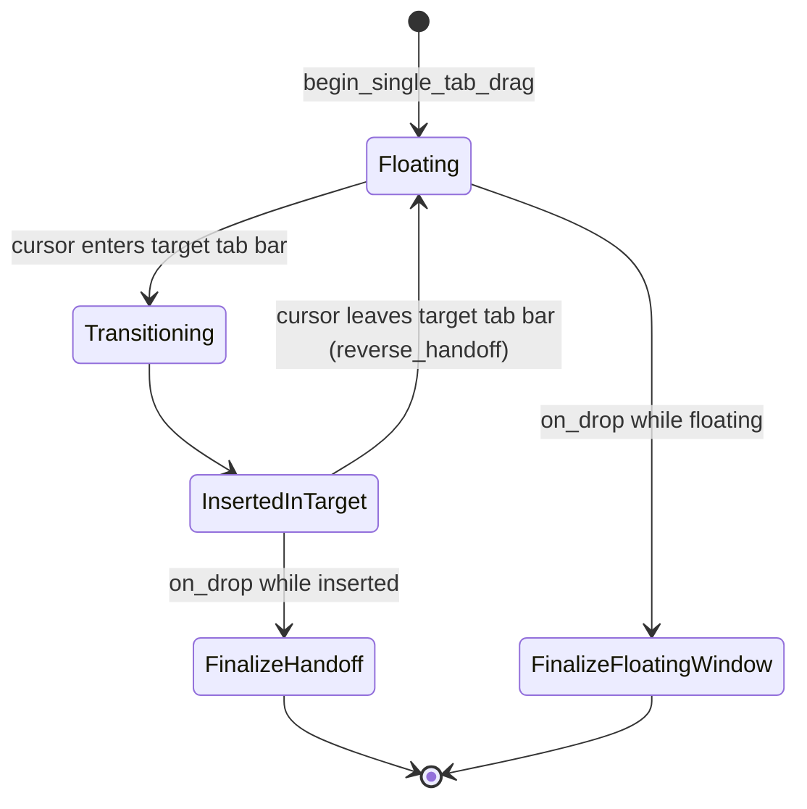
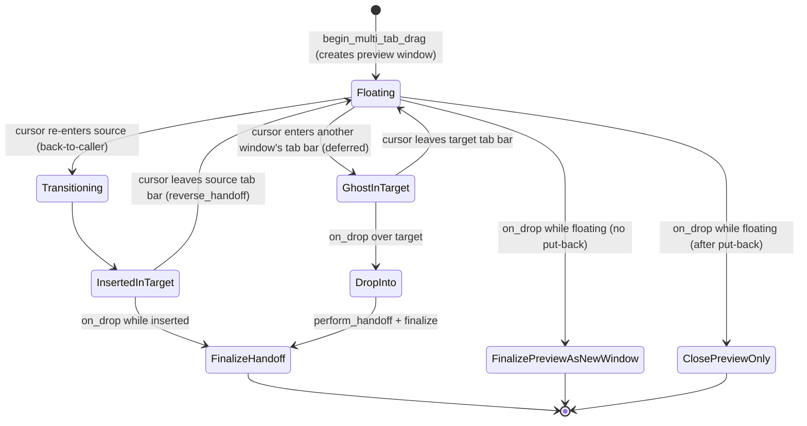

# Cross-Window Tab Drag (Tech Spec)

## 1. Problem

Cross-window tab drag is not just an extension of in-window tab reordering. The feature crosses three boundaries the local reorder path does not:

1. it moves a live tab — including its real `PaneGroup` view tree, terminal processes, and editor state — between different windows
2. it creates, hides, shows, reuses, and closes native windows while the drag is still in progress
3. it must keep one continuous drag gesture alive across reorder, detach, attach, drop-back-into-source, and re-detach without re-entrant view mutations corrupting state

The implementation therefore needs to coordinate source workspace state, target workspace state, preview-window lifecycle, native z-order and focus, persistence, and cleanup of transferred views — all while the user holds the mouse button down. The goal is to satisfy the product behavior in `specs/pei/cross-window-tab-drag/PRODUCT.md` without introducing duplicate tabs, blank windows, stale subscriptions, persistence races, or destructive close behavior.

## 2. Relevant code

- `specs/pei/cross-window-tab-drag/PRODUCT.md` — product behavior the implementation must satisfy.
- `app/src/workspace/cross_window_tab_drag.rs` — singleton drag state machine; module-level doc has the canonical ASCII state diagrams.
- `app/src/workspace/view.rs` — `Workspace::on_tab_drag`, `perform_handoff`, `handle_drop_result`, `tab_insertion_index_for_cursor`, `tab_bar_rects_for_window`, `prepare_for_transferred_tab_attach`, `close_window_for_content_transfer`, `on_window_closed`, ghost chip / insertion slot rendering.
- `app/src/workspace/view/vertical_tabs.rs` — vertical-tabs UI dispatching the same `StartTabDrag` / `DragTab` / `DropTab` actions and rendering the same insertion slot.
- `app/src/tab.rs` — top tab-bar `Draggable` wiring, drag-axis gating, hover-overlay suppression, and the `for_drag_ghost` render shortcut used by the floating chip.
- `app/src/root_view.rs` — `create_transferred_window`, which materializes the multi-tab preview window and adopts the transferred pane group.
- `app/src/app_state.rs` — `get_app_state` skips serialization while a drag is active.
- `ui/src/core/app.rs` — `transfer_view_to_window` / `transfer_view_tree_to_window` / `transfer_structural_children`, focus-suppression hooks, view/window ownership state.
- `ui/src/platform/mod.rs` — `WindowManager::ordered_window_ids`, `cancel_synthetic_drag`, `WindowStyle::PositionedNoFocus`, `TerminationMode::ContentTransferred`.
- `crates/warpui/src/windowing/winit/window.rs` and `crates/warpui/src/platform/mac/{window.rs,objc/window.m}` — backend implementations of the platform contract.
- `crates/integration/src/test/workspace.rs` — integration coverage for detach, attach, reattach, reverse-handoff, and drop-outside flows; gated on the feature flag rather than the OS.

## 3. Architecture

### 3.1 `Workspace` is the event ingress and source-side cleanup owner

`Workspace::on_tab_drag` decides, on every `DragTab` event, whether the gesture is:

- a local in-window reorder
- a first-time detach into a cross-window drag, or
- a forwarded event for an already-active cross-window drag (when `CrossWindowTabDrag::is_active()`)

Workspaces own their own tab list and `PaneGroup` subscriptions. The `Workspace` view extracts `TransferredTab` snapshots, performs the source-side cleanup indicated by `DropResult`, and runs the lifecycle hook (`on_window_closed`) that finishes the drag's persistence guard. It does **not** mutate other workspaces directly.

### 3.2 `CrossWindowTabDrag` is a singleton state machine

All cross-window drag state lives in a single `CrossWindowTabDrag` model registered alongside `WorkspaceRegistry`. A per-workspace model would either duplicate state or require one workspace to imperatively mutate another during drag processing.

The singleton owns:

- `ActiveDrag` — the currently in-flight drag (or `None`)
- `pending_source_window_closes: HashSet<WindowId>` — source / preview windows whose async close is in flight (see §6 for why this is a set, not a boolean)

`Workspace` calls `on_drag` / `on_drop` and inspects the returned `DragResult` / `DropResult` enums to decide what follow-up action to take. This indirection is the key to avoiding re-entrant view mutations: the model can reason about the global state and return a coordinated decision while every workspace stays single-owner of its own tabs.

### 3.3 The transferable unit is a live view tree

`TransferredTab` carries the real `PaneGroup` plus the tab metadata and `DraggableState` needed to preserve continuity. Transfers happen via `transfer_view_tree_to_window`, not by serializing and re-creating tabs from a snapshot.

This preserves:

- running terminal/process identity (no PTY restart)
- pane / view identity across attach and reverse-handoff
- left/right panel open state and any in-flight panel animations
- drag continuity through `DraggableState`

`AppContext` support for `view_to_window`, structural parent/child tracking, and `transfer_structural_children` ensures non-rendered structural children move with the root pane group instead of being stranded in the old window. Rebuilding a tab from serialized state would be simpler on paper but wrong for this feature — identity preservation is what makes "drag a running tab between windows" feel like one gesture instead of a kill-and-respawn.

### 3.4 Two preview strategies, depending on source-window shape

The split between single-tab and multi-tab sources is intentional, not implementation noise:

- **Single-tab source.** The source window IS the floating preview. `begin_single_tab_drag` repositions the source window directly under the cursor and stores it as both source and preview. No dedicated preview window is created. The dragged tab's `Draggable` overlay paint is suppressed (`set_suppress_overlay_paint(true)`) so the tab is not rendered twice (once inside the moving window and once as a drag overlay), which is what previously caused visible text jitter on this path.

- **Multi-tab source.** A dedicated preview window is created via `create_transferred_window` with `WindowStyle::PositionedNoFocus` and `is_tab_drag_preview = true`. The live pane group is transferred from the source into the preview, the source switches to an adjacent tab if the dragged tab had been active, and the source's placeholder `TabData` is marked `detached` and rendered at zero width while the drag continues.

Both strategies converge on the same state machine (§4) once `Floating` is reached; only the preview-window lifecycle differs.

### 3.5 The drag UI is shared across tab presentations

The horizontal tab bar (`tab.rs`) and the vertical tabs panel (`vertical_tabs.rs`) emit the same `WorkspaceAction`s:

- `StartTabDrag`
- `DragTab { tab_index, tab_position }`
- `DropTab`

Only the presentation-specific drag geometry differs. Drag orchestration belongs in workspace-level logic, not in individual tab UIs. The UI layer hosts the `Draggable`, reports drag rectangles back to `Workspace`, and decides only presentation-specific things such as drag axis or row layout. It does not own source/target mutation, preview-window lifecycle, attach-target selection, or cross-window drop finalization.

When `FeatureFlag::DragTabsToWindows` is enabled, neither tab UI applies a `DragAxis` lock; without that lock the user can pull the tab perpendicular to the tab axis to detach. When the flag is off, each UI re-applies its presentation-appropriate axis lock (`HorizontalOnly` for top tabs, `VerticalOnly` for vertical tabs).

## 4. State machine

The full ASCII versions live in the module-level doc on `CrossWindowTabDrag`. The Mermaid renderings here are equivalent.

### 4.1 Single-tab source window

The source window itself acts as the preview, so `FinalizeFloatingWindow` just leaves the source window where the user dropped it; no extra window is created.

### 4.2 Multi-tab source window

The two `Floating` drop branches are gated on `ActiveDrag::source_placeholder_consumed`; see §5.3.

### 4.3 Why `GhostInTarget` defers the view-tree transfer

The earlier design moved the dragged tab's pane group into the target the instant the cursor crossed into its tab bar. That immediately caused two performance problems:

- **Sustained double-render cost.** Once the tab was inserted, the target rendered two sets of terminal content per frame — its own tabs plus the transferred tab's terminal. Terminal rendering is expensive enough that hovering with the cursor still in the middle of the target window was visibly laggy.
- **Boundary oscillation spikes.** Cursor motion near the tab-bar edge repeatedly crossed in and out, triggering a forward `execute_handoff` and a `reverse_handoff` per crossing, plus `workspace:save_app` snapshots on both windows.

`GhostInTarget` replaces the live transfer during hover with two cheap visual elements rendered inside the target window:

- A floating chip — a tab-shaped overlay with the dragged tab's icon and title, anchored to the cursor. The chip's contents are produced by the same `TabComponent` / `render_tab_group` paths the source layout uses, with a `for_drag_ghost` flag that suppresses the inner `Draggable` and `SavePosition` so the chip does not interfere with the in-flight drag or clobber the target's `tab_position_<index>` cache.
- An insertion slot — an empty constrained box at the predicted insertion index, with the same background the in-window drag uses for a tab's origin slot. The chip already shows what is being dragged, so the slot only has to show where it will land.

While in `GhostInTarget` the only per-frame work is updating a `Vector2F`, recomputing the insertion index, and notifying the target to redraw. No view-tree operations, no `save_app` snapshots. The real `transfer_view_tree_to_window` runs only on drop, via `DropResult::DropInto`.

`InsertedInTarget` is kept for the back-to-caller case (multi-tab drag re-entering the source's own tab bar). That path needs a real transfer because reordering inside the source uses the same in-window code path that mutates `self.tabs`, and because the preview window must stay alive in case the user drags back out again. It is lower-frequency than cross-window hover and does not have the double-render problem because there is only one window involved.

### 4.4 `Transitioning` is the re-entrancy guard

`DragPhase::Transitioning` is set immediately before any view-tree transfer and cleared after. While the phase is `Transitioning`, `on_drag` short-circuits. The WarpUI framework does not support re-entrant drag processing during a view-tree transfer; this phase is what makes that contract observable from the singleton without leaking it into every caller.

## 5. Drop resolution

`CrossWindowTabDrag::on_drop` is the only place that decides what becomes of the drag at mouse-up. It returns a `DropResult` variant; `Workspace::handle_drop_result` performs the source-side cleanup, and the singleton's own logic has already done the cross-workspace mutations (closing the preview, focusing the target, etc.).

### 5.1 Variants

- `NoOp` — nothing for the calling workspace to do.
- `FocusSelf` — single-tab floating drop; the source window IS the preview, so just focus its active tab.
- `CloseSourceWindow { transferred_tab_index }` — the source window's only tab was transferred; close the source window with `ContentTransferred`.
- `RemoveSourceTab { transferred_tab_index }` — multi-tab source, tab transferred elsewhere; remove the placeholder.
- `RemoveSourceTabAndClosePreview { transferred_tab_index, preview_window_id }` — same, plus close the now-unused preview.
- `ClosePreviewOnly { preview_window_id }` — see §5.3.
- `DropInto { target }` — see §5.2.

### 5.2 `DropInto`: drop-time re-resolution and ghost commitment

The cursor can sit over a target tab bar at the moment of release without the preceding drag event having committed to a phase that anticipates a real handoff:

- For a `GhostInTarget` drop, the singleton has been deliberately deferring the transfer; `on_drop` must commit it now.
- For a `Floating` drop where the cursor happens to land directly over a tab bar that wasn't reachable from the previous drag tick (window z-order shift, late frame, etc.), the singleton runs one final `cross_window_attach_target` resolution gated by `drop_resolution_attempted` so it can only happen once per drag.

In both cases `on_drop` returns `DropResult::DropInto { target }` and leaves `active_drag` in place. `handle_drop_result` then runs `Workspace::perform_handoff(target, ctx)` — the same path used during drag — and recursively re-invokes `finalize` + `handle_drop_result` so the drag terminates through the normal `FinalizeHandoff` branch.

This is what makes "release the mouse directly over a tab bar" produce the expected attach result instead of a stray new window.

### 5.3 `ClosePreviewOnly`: avoiding overlap between put-back and preview promotion

The multi-tab put-back path (drag back into the source window, real transfer to `InsertedInTarget`) and the new-window path (drop in empty space, promote preview) are logically exclusive, but the user can produce a sequence that touches both inside one drag:

1. Drag a multi-tab tab out → preview holds the pane group.
2. Drag back over the source tab bar → `Transitioning` → `InsertedInTarget`. `Workspace::perform_handoff` removes the source's detached placeholder and re-inserts the real tab; this sets `ActiveDrag::source_placeholder_consumed = true`. The preview's `tabs` is **not** cleared by put-back — it still carries a `TabData` referencing the same pane group.
3. Drag back off the tab bar → `reverse_handoff` moves the pane group back into the preview and the source's freshly-re-inserted tab is removed. Phase → `Floating`.
4. Release in empty space.

If the `Floating` drop branch unconditionally promoted the preview to a permanent window, both windows would now hold a `TabData` referencing the same pane group, and the next `save_app` would trip a `terminal_panes.uuid` UNIQUE constraint. The fix has two parts:

- `on_drop` skips the drop-time re-resolution path entirely when `source_placeholder_consumed` is true. The put-back has already committed the tab to the source; re-resolving would only run a second `perform_handoff` against a now-stale `source_tab_index`.
- `finalize_preview_as_new_window` branches on `source_placeholder_consumed` **before** promoting:
  - **consumed**: do not clear `is_tab_drag_preview`, do not focus, do not promote; close the preview with `TerminationMode::ContentTransferred` and return `DropResult::ClosePreviewOnly { preview_window_id }`.
  - **not consumed**: keep the existing promotion path: clear `is_tab_drag_preview`, also clear `suppress_detach_panes_on_window_close` (latched true by every forward handoff out of the preview and not cleared by `reverse_handoff`), re-sync window chrome, focus, return `CloseSourceWindow` / `RemoveSourceTab`.

The `ClosePreviewOnly` variant is what makes the "drag out, put back, drag back out, drop in empty space" sequence end cleanly.

### 5.4 Defensive bail-out in `perform_handoff`

`Workspace::perform_handoff`'s `target == caller` branch checks `CrossWindowTabDrag::source_placeholder_consumed()` first and resets to `Floating` (with a warning log) if it would otherwise re-enter put-back against a stale `source_tab_index`. Together with the `on_drop` guard above, this means the overlap is observable rather than silently corrupting an unrelated tab.

## 6. Persistence and lifecycle

`get_app_state` (`app/src/app_state.rs`) skips per-window serialization while `CrossWindowTabDrag::is_active()` returns true. The naive "is there an active drag?" definition was insufficient because every drop path that closes a source or preview window has an asynchronous tail:

1. `on_drop` returns a `DropResult`.
2. `handle_drop_result` runs synchronously in the same action dispatch, possibly scheduling `ctx.windows().close_window(..., TerminationMode::ContentTransferred)`.
3. The actual `Workspace::on_window_closed` for that window runs a tick or more later.

Between steps 2 and 3 the source workspace is still in `WorkspaceRegistry` with its original `TabData` intact while the target / promoted-preview workspace already holds a `TabData` referencing the same pane group. Any `save_app` dispatched in that gap (e.g. from the deferred focus, an active-window-changed observer, or a neighbor window's resize) saves both sides and tries to insert the same `terminal_panes.uuid` twice.

The guard is therefore lifecycle-driven, not temporal:

- `CrossWindowTabDrag::pending_source_window_closes: HashSet<WindowId>` records the window ids whose close was requested as part of a handoff.
- `is_active()` returns `active_drag.is_some() || !pending_source_window_closes.is_empty()`.
- `finalize` registers the relevant window id whenever it returns a result that triggers an async close: `CloseSourceWindow`, `RemoveSourceTabAndClosePreview`, or `ClosePreviewOnly`. It does **not** register for `FocusSelf`, `RemoveSourceTab`, `NoOp`, or `DropInto` — those leave no duplicate state after `handle_drop_result` returns.
- `Workspace::on_window_closed` calls `finish_pending_source_close(window_id)` after `WorkspaceRegistry::unregister`. The first `save_app` that follows the close sees `is_active() == false` and the duplicate workspace already gone from the registry.

The HashSet shape (rather than a single boolean) is what lets multiple in-flight closes coexist when, for example, a `FinalizeHandoff` in one drop closes a source window while a subsequent `ClosePreviewOnly` from a different drag has its own preview close pending.

### Transfer-aware close primitives

A cluster of small lifecycle flags and helpers make transfer-driven closes silent:

- `Workspace::is_tab_drag_preview` — temporary marker on multi-tab preview workspaces. Forces `tab_bar_mode` to `Stacked`, removes traffic lights, and is read by `get_app_state` so previews never persist.
- `Workspace::suppress_detach_panes_on_window_close` — set by `prepare_for_transferred_tab_attach` before a pane group moves out, and again by `close_window_for_content_transfer`. `on_window_closed` only calls `detach_panes` when this flag is `false`. Important: this flag is **not** cleared by `reverse_handoff` for the multi-tab case, so `finalize_preview_as_new_window` clears it explicitly when promoting a preview to a permanent window.
- `TerminationMode::ContentTransferred` — used by every transfer-driven `close_window` call. Avoids the "Close window?" confirmation that the destructive close path would otherwise show.

## 7. Layout-agnostic geometry

Cross-window drag must work for both the horizontal tab bar and the vertical tabs panel. The single horizontal-only assumptions that the original design baked in have been replaced by helpers that take both presentations into account.

### 7.1 `tab_bar_rects_for_window`

Lives in `view.rs`. Returns a `Vec<RectF>` containing whichever of the horizontal `TAB_BAR_POSITION_ID` and vertical `VERTICAL_TABS_PANEL_POSITION_ID` rects are currently laid out — 0, 1, or 2 rects per window. Both must be considered because a window with the vertical tabs panel open still renders the horizontal bar at the top.

`Workspace::on_tab_drag` uses this to decide "is the drag still inside any tab presentation on its perpendicular axis?" — the drag is treated as outside the tab bar only when **every** rendered presentation says it's outside its own perpendicular axis. `cross_window_attach_target` and the target-side stay-check use the same helper to hit-test all candidate presentations.

### 7.2 `TAB_BAR_HIT_MARGIN` is shared between entry and stay checks

`cross_window_attach_target` expands each tab-bar rect by `TAB_BAR_HIT_MARGIN = 12.0` pixels before testing the cursor, so small overshoots still register as a hit. The corresponding stay-check (used while in `GhostInTarget` / `InsertedInTarget` to decide whether to trigger `reverse_handoff`) uses the **same** expansion. Asymmetric thresholds would produce a 12-pixel hysteresis band where one frame's entry handoff would fire and the next frame's stay check would immediately reverse it — a tab-bouncing bug at the rim of the target.

### 7.3 `tab_insertion_index_for_cursor` detects orientation from spread

The insertion-index helper used by both the cross-window attach path and the in-window reorder path inspects the `tab_position_<index>` cache and decides between horizontal and vertical layout by comparing the spread of tab centers along each axis (X vs Y). With a single tab present (no spread to compare), it falls back to whether the vertical-tabs panel is open. The cursor's coordinate along the dominant axis then drives the index.

The helper also defends against accidental cache pollution: any tab-position cache entry whose center sits outside every `tab_bar_rects_for_window` rect is rejected. This is what prevents the floating chip's own `tab_position_<n>` (if it were ever to leak through) from being treated as a real tab. The chip rendering path already uses a `for_drag_ghost` flag that strips the inner `SavePosition` and `Draggable`, but the rejection here is a belt-and-suspenders guarantee.

### 7.4 `cross_window_attach_target` walks z-order

The model uses `WindowManager::ordered_window_ids()` to walk windows behind the preview in z-order. When the preview is in the ordered list (multi-tab case), only z-behind windows are considered; this is what makes the product invariant "an occluded window cannot receive the drop through a window in front of it" hold.

For the single-tab case the source window IS the preview and may or may not be in the ordered list, so the model falls back to scanning all workspaces and picking the candidate whose tab-bar-rect center is closest to the cursor, again gated on the expanded-rect hit test.

## 8. Platform contracts

Backend specifics belong in the windowing layer. The cross-window drag code expects the following platform contracts:

- create a window at exact bounds (no system placement)
- materialize a window without stealing focus from the active typing context (`WindowStyle::PositionedNoFocus`)
- expose front-to-back ordering of Warp windows for attach targeting (`WindowManager::ordered_window_ids`)
- continue delivering drag events to the originating window even after that window's z-order or visibility changes
- close a window with `TerminationMode::ContentTransferred` so transfer-driven closes do not run destructive close semantics
- cancel any synthetic native drag the platform may have started under the source window when the singleton takes over preview movement (`cancel_synthetic_drag` on macOS, where AppKit otherwise drags the window itself)
- a focus-suppression hook (`AppContext::set_suppress_focus_for_window`) for the brief gap between creating a preview window and its content being ready to render

The winit and macOS backends in this PR satisfy all of these. New backends only need to honor the contracts above — none of the cross-window drag code is OS-specific by design.

## 9. Risks and mitigations

### Re-entrant drag handling during view transfer

Risk: moving views between windows triggers invalidation while a drag event is still in flight.
Mitigation: `DragPhase::Transitioning` short-circuits `on_drag` while a transfer is in progress.

### Duplicate tabs / stale view subscriptions

Risk: a transferred tab remains visible or subscribed in the wrong workspace.
Mitigation: `prepare_for_transferred_tab_attach` before transfer, `insert_transferred_tab_at_index` on receipt, hide the source placeholder visually rather than deleting it early, remove or close the source side only during finalization.

### Wrong attach target with overlapping windows

Risk: the cursor hits a visually occluded tab bar and the tab inserts into the wrong window.
Mitigation: `cross_window_attach_target` walks `ordered_window_ids()` z-behind the preview and does actual tab-bar hit testing.

### Hit-test hysteresis at the tab-bar rim

Risk: asymmetric entry / stay thresholds bounce the dragged tab in and out across a single drag frame.
Mitigation: both checks use `expanded_rect(_, TAB_BAR_HIT_MARGIN)`.

### Single-tab drag jitter from double-rendered preview state

Risk: the single-tab path repositions the real window while the source tab's `Draggable` still paints its own drag overlay, producing extra paint churn and visible text jitter.
Mitigation: `begin_single_tab_drag` calls `set_suppress_overlay_paint(true)` on the source tab; later transitions clear it as appropriate.

### Sustained perf cost from live target rendering during hover

Risk: inserting the dragged tab into the target on hover doubles per-frame terminal rendering and triggers `save_app` on each cursor crossing.
Mitigation: `GhostInTarget` defers the transfer to drop time; the chip and insertion slot are the only per-frame work.

### Source / preview windows destroy transferred panes on close

Risk: transfer-driven window close behaves like destructive close.
Mitigation: `suppress_detach_panes_on_window_close`, `close_window_for_content_transfer`, `TerminationMode::ContentTransferred`.

### Preview windows leak into persistence

Risk: app-state snapshots capture transient preview windows.
Mitigation: `is_tab_drag_preview` is checked in `get_app_state`.

### `terminal_panes.uuid` UNIQUE collision during async close

Risk: between `finalize` and the OS-delivered `on_window_closed`, both source and target/promoted-preview workspaces hold the same pane group and `save_app` collides.
Mitigation: lifecycle-driven `pending_source_window_closes` (set of window ids) keeps `is_active()` true through the close window; `Workspace::on_window_closed` clears the entry.

### Put-back + new-window overlap

Risk: a multi-tab put-back followed by a `Floating` drop in empty space leaves the preview holding a duplicate `TabData` referencing the source's pane group.
Mitigation: `ActiveDrag::source_placeholder_consumed` short-circuits the drop-time re-resolution and routes `finalize_preview_as_new_window` to `ClosePreviewOnly` instead of preview promotion.

### Stale `source_tab_index` after put-back+reverse

Risk: a re-entry into the put-back branch operates on `source_tab_index` whose tab is no longer there.
Mitigation: `Workspace::perform_handoff`'s `target == caller` branch checks `CrossWindowTabDrag::source_placeholder_consumed()` and resets to `Floating` with a warning log.

### Drift between tab UIs

Risk: top tabs and vertical tabs evolve separate drag behavior and stop matching product expectations.
Mitigation: both UIs dispatch the same actions; all drag orchestration lives in `Workspace` + `CrossWindowTabDrag`.

## 10. Testing and validation

### Automated coverage

Integration tests in `crates/integration/src/test/workspace.rs` exercise:

- detach into preview, attach into another window, drop, and continued drag after attach
- starting from a single-tab source, attaching into another window, then dragging back out
- repeated attach / detach cycles with assertions on final window count, total tab count, focus, and editor state

The tests are gated on `drag_tabs_feature_enabled()` (the feature flag), not on the host OS, which matches the cross-platform architecture.

### Validation that should not regress

- detach → ghost → drop into target on both horizontal and vertical-tabs targets
- single-tab handoff → reverse-handoff → drop
- repeated attach / detach cycles with no tab duplication and no `terminal_panes.uuid` UNIQUE errors in the log
- overlapping-window attach targeting: the occluded window cannot receive the drop through the window in front
- preview / source windows never flash blank or transparent
- no close-confirmation dialog appears for transfer-driven closes
- the resulting active tab is focused after drop in every termination state
- both top tabs and vertical tabs drive the same cross-window behavior

### What does not count as sufficient

- local reorder tests alone
- snapshot/restore tests alone
- backend-specific manual validation that does not also exercise the singleton's state machine

The highest-risk areas remain continuous drag across attach/detach transitions, drop-time re-resolution, and lifecycle cleanup around `pending_source_window_closes` / `source_placeholder_consumed`.

## 11. Follow-ups

- Make the preview's `tabs` vector the single source of truth during a multi-tab drag, so put-back moves the `TabData` from preview to source instead of cloning through `TransferredTab`. The `source_placeholder_consumed` flag could then be removed; the dual-ownership state never exists. Out of scope for this PR because it touches `reverse_handoff`, `execute_handoff_back_to_caller`, and all promotion paths.
- Cache the raw screen-space cursor directly from `MouseDragEvent` instead of reconstructing it from `caller_window_origin + drag_in_window`, so the drop-time re-resolution stays accurate even when the preview window's bounds are being chased frame by frame.
- Continue hardening backend validation for preview focus and ordered-window targeting on platforms where native window behavior differs.
- If a third tab UI is added in the future, require it to dispatch the same action trio rather than introducing a second cross-window drag implementation.
