# Tech spec: scope SSE event subscriptions to open parent/child conversations

## Context

`OrchestrationEventStreamer` (`app/src/ai/blocklist/orchestration_event_streamer.rs`) delivers v2 orchestration events (cross-agent messages and lifecycle events) into a conversation by holding a long-lived SSE connection per conversation. The streamer is SSE-only and gated solely on `OrchestrationV2`; the previous polling fallback path was removed before this change so all state and code paths described below are SSE-only.

A key semantic to keep in mind throughout: **an agent run subscribes to its own `run_id` because that subscription is its inbox.** Server-side, `AgentEventDriverConfig::run_ids` filters events whose run_id matches the set; for a given agent run, events with `run_id == self_run_id` are messages and lifecycle signals destined for that run. Both parent agent runs and child agent runs (including headless CLI children of any harness) must keep this subscription up while their run is active in order to receive messages.

> **Note.** The "Today the lifecycle is wrong" subsection and the "Relevant code" listing below describe the *pre-rewrite* state of the streamer (then often called "the poller") that motivated this change. Specific identifiers, line numbers, and field names in those subsections are historical and no longer correspond to the current code. The "Proposed changes" section onwards reflects the implementation as it now exists.

Today the lifecycle is wrong in three ways:

1. **Wrong start trigger.** SSE only opens on the `ConversationStatus::Success` transition (`orchestration_event_streamer.rs:229-237`, `start_event_delivery` at line 494). A conversation that is open in the UI but still in-progress will not subscribe; conversely once it has subscribed, status no longer matters.
2. **Wrong stop trigger for parents.** Cleanup only runs on `RemoveConversation`/`DeletedConversation` (lines 178-193). Closing the agent view of a parent conversation does not tear down its SSE, so a parent the user has abandoned in the UI keeps a live connection.
3. **Wrong scope.** `on_server_token_assigned` (line 240) registers the conversation's own run_id for *every* cloud-backed conversation that gets a server token (except shared-session viewers, line 254). Solo conversations — neither parents (have spawned children) nor children (`parent_conversation_id` set) — are not part of an orchestration tree and cannot meaningfully receive or send orchestration events. They should not subscribe. The shared-session-viewer exclusion is also incomplete: the GUI auto-opens a viewer pane for cloud children spawned via `start_agent` (`Conversation::is_remote_child()` is true), and those placeholders look like child conversations to the predicate — they have `parent_conversation_id` set — even though the actual run is on a cloud worker. Without a guard they open a redundant SSE in the parent's process for events the parent's own SSE will already deliver.

There is also a related state-leak: `register_watched_run_id` (line 138) only inserts into `watched_run_ids`; nothing removes a child's run_id when the child finishes or is deleted. A long-lived parent accumulates dead run_ids and reconnects with an ever-growing filter.

### Relevant code

- `app/src/ai/blocklist/orchestration_event_streamer.rs` — owner of `watched_run_ids`, `sse_connections`, polling/SSE timers, and all cleanup paths.
- `app/src/ai/blocklist/action_model/execute/start_agent.rs:112-119` — the only external caller of `register_watched_run_id`, registering a *child's* run_id under the *parent's* `AIConversationId` when the child receives a server token.
- `app/src/ai/active_agent_views_model.rs` — already tracks "is this conversation expanded in any pane?" via `agent_view_handles`. Emits `ActiveAgentViewsEvent::ConversationClosed { conversation_id }` on `ExitedAgentView` (line 167-169) and on `unregister_agent_view_controller` from the pane-close path (line 200-202; see `pane_group/pane/terminal_pane.rs:383-385`). Helper `is_conversation_open(conversation_id, ctx)` (line 354) gives the cross-pane "open anywhere?" check.
- `app/src/ai/agent/conversation.rs:781-792` — `parent_conversation_id()` and `is_child_agent_conversation()` classify a conversation as child or non-child; combined with the poller's own `watched_run_ids` set these classify a conversation as parent/child/solo.
- `app/src/ai/agent_events/driver.rs (38-50, 177-199)` — `AgentEventDriverConfig::run_ids` is forwarded to `ServerApi::stream_agent_events` and is the server-side filter for which events come back. A run watching its own run_id is using that subscription as its inbox.
- `app/src/ai/agent_sdk/driver.rs` — drives Oz conversations headlessly via the Warp CLI (locally for `start_agent` with `execution_mode: local` + Oz harness, and on cloud workers for cloud Oz runs). The same `OrchestrationEventStreamer` singleton is registered here (`lib.rs:1564-1566` is unconditional aside from the `OrchestrationV2` feature flag), so the streamer must serve a CLI/cloud process where there are no `AgentViewController` registrations at all.

## Proposed changes

### Consumer abstraction

The streamer's job is to deliver events to a consumer. Today there is one implicit consumer (the agent view), but in CLI and cloud worker processes the consumer is the `agent_sdk::driver` itself, which has no agent view. Generalize this: the streamer owns a set of registered *consumers* per conversation, where a consumer is anything that needs orchestration events delivered for that conversation.

The registry lives **inside `OrchestrationEventStreamer`** as part of the per-conversation `ConversationStreamState` (a single `streams: HashMap<AIConversationId, ConversationStreamState>` map collects every per-conversation field — watched run_ids, cursor, pending message IDs, consumers, SSE connection, restore-retry counter — under one entry). Consumers are identified by `EntityId` (the terminal pane id for an agent view; the driver model id for `agent_sdk`). Two public methods drive the registry:

- `register_consumer(conversation_id, consumer_id, ctx)` — inserts and re-evaluates eligibility through `reevaluate_eligibility`, which calls `start_sse_connection` if the conversation is newly eligible.
- `unregister_consumer(conversation_id, consumer_id, ctx)` — removes and re-evaluates eligibility, tearing down the SSE if the conversation is no longer eligible.

This avoids introducing a separate singleton and the event-subscribe plumbing that would come with it. The streamer is the only consumer of these signals, so co-locating the state keeps the lifecycle decisions in one place.

Two callers wire up registrations through the free helpers `register_agent_event_consumer` / `unregister_agent_event_consumer`:

- The agent view path: `ActiveAgentViewsModel` reacts to `EnteredAgentView` / `ExitedAgentView` and calls the helpers on behalf of the open view.
- The driver path: `agent_sdk::driver` calls the same helpers around its run lifetime.

The streamer's eligibility check observes a single signal — `has_active_consumer(conversation_id)` reads the conversation's stream entry — and does not care which type registered. In the GUI client this collapses to "agent view is open somewhere"; in CLI/cloud workers it collapses to "the driver is running."

A single `EntityId` per consumer is enough: the streamer treats every consumer as opaque, the entity id is unique per pane / driver model, and unregister keys back to that same id.

### Eligibility predicate

The streamer treats parent and child agent runs differently because the trigger conditions are different, but both check the same consumer signal.

**Child role** — the conversation has a parent agent run from this process's perspective. Two signals satisfy this: `parent_conversation_id.is_some()` (the parent has a local placeholder, set by `start_new_child_conversation` when the GUI parent spawned the child) OR `parent_agent_id.is_some()` (the conversation knows its parent's server-side agent identifier, which under v2 is the parent's `run_id`). The two signals address two different processes:

- The parent's GUI process gets `parent_conversation_id` set when it creates the child placeholder via `start_new_child_conversation`.
- The driver-hosted process (CLI subprocess for `execution_mode: local`, cloud worker for cloud children) never sees the parent's local `AIConversationId`. It does fetch the parent's `run_id` from the server task metadata (`get_ambient_agent_task` returns `parent_run_id`), so the agent_sdk driver stamps that run_id onto the conversation's `parent_agent_id` field at register time. That stamp is what the streamer's child-role check picks up.

The subscription is the child's inbox. It is gated on having an active consumer in *this process* the same way the parent role is. In the process where the child run actually lives, the agent_sdk driver registers a consumer for the run's lifetime, so the child's inbox stays live for the whole run. In any other process (e.g. the user's GUI tracking a cloud child), the child's own SSE only opens while a consumer is registered — i.e. the child's agent view is open. Without a local consumer the events would have nowhere to land, and the user's GUI already sees child→parent traffic via the parent's SSE. This applies to every harness — Oz, ClaudeCode, Gemini, headless CLI children spawned via `start_agent` with `execution_mode: local`, and cloud children. Children today cannot themselves spawn children; if that constraint is lifted later, this role keeps applying unchanged.

**Parent role** — the conversation has at least one child run_id registered in `watched_run_ids` (from `register_watched_run_id` in `start_agent.rs`). The subscription delivers child lifecycle and child→parent messages into the parent's consumer. The parent role is gated on having an active consumer. In the GUI that means the agent view is open; in CLI/cloud it means the agent driver is running. When the last consumer for a parent disappears, child events for that parent are stored on the server and backfilled via the cursor when a consumer comes back.

Today, child agent runs cannot themselves spawn children, so no live conversation simultaneously holds both roles. The design must still admit the case so that allowing children-of-children later is a code change to the spawn path, not to the subscription model. Both roles' run_id contributions are unioned into the SSE filter whenever both apply.

The stronger present-day motivator for the consumer abstraction is a different shape: a top-level cloud Oz agent run — not itself a child — that spawns children. It has the parent role only, runs on a cloud worker with no agent view, and is driven by the agent_sdk driver. Without the consumer abstraction the parent gate would never be satisfied (no agent view ever exists in that process) and the cloud Oz agent could not receive its children's events. With the abstraction the driver registers as the consumer and the parent role is eligible.

**Solo conversations** — neither parent nor child — are excluded. They have no role in the orchestration tree and no inbox traffic to receive.

Formally, a conversation should be subscribed iff:

```
has_active_consumer()
  AND (is_child_agent_conversation() OR has_at_least_one_watched_child_run_id())
```

Where `has_active_consumer()` returns true when at least one `AgentViewController` or `agent_sdk::driver` is registered for this conversation. This predicate is the single invariant the streamer maintains. Every code path either makes a conversation eligible (and ensures a connection exists) or makes it ineligible (and tears the connection down).

### Subscription drivers

**Children.** The trigger is server-token assignment, not status. `on_server_token_assigned` calls `ensure_self_run_id_watched` to register the self run_id and re-runs `reevaluate_eligibility` immediately. Children must be listening as soon as they have a run_id, regardless of status. Teardown for children happens only on `RemoveConversation` / `DeletedConversation`.

**Parents.** Subscribe to a single "consumer changed" signal from the registry described above:

- On consumer-removed for a conversation: `reevaluate_eligibility` runs the predicate and tears the SSE down if the conversation is no longer eligible. If it is also a child, the child role keeps it alive.
- On consumer-added for a conversation: `reevaluate_eligibility` opens the SSE if newly eligible. This handles both the GUI reopen case (agent view opened after being closed) and the CLI startup case (driver registered before any agent view exists).
- `register_watched_run_id` (called from `start_agent.rs`) re-evaluates eligibility after the insert. If a consumer exists, this opens or reconnects the SSE; if none exists, it is a no-op until a consumer registers.

`reevaluate_eligibility` is the single dispatch point: it computes the eligibility predicate and either calls `start_sse_connection`, reconnects, or tears down. Status is not part of the lifecycle decision for either role.

The agent_sdk driver registers itself as a consumer at the start of its run (a natural place is `AgentDriver::execute_run` for Oz, or where the third-party harness path picks up the `task_id` for ThirdParty harnesses) and unregisters when the run terminates. Registration is by `AIConversationId` so it composes with the existing per-conversation streamer state.

Because both roles share a single SSE connection per conversation, the SSE's `run_ids` filter must be the union of `{self_run_id}` (child role) and the registered child run_ids (parent role), where each role's contribution is included only when that role's eligibility is met. The simplest implementation is to compute the run_id list at SSE-open time from current state.

### Trigger ordering and re-evaluation

Eligibility depends on three pieces of state, each of which lands at a different time and is set by a different code path:

- `Conversation::has_parent_agent()` — true when the conversation has either `parent_conversation_id` (set on a child created with a local placeholder) or `parent_agent_id` (the parent's run_id, stamped by the agent_sdk driver in driver-hosted processes). Available before any run_id is assigned for the local-placeholder case; depends on the parent's run_id for the driver case.
- `self_run_id` — set on `ConversationServerTokenAssigned` for this conversation.
- Watched child run_ids on a parent — added by `register_watched_run_id` only after the *child* receives its server token (`start_agent.rs` waits for `ConversationServerTokenAssigned` on the child, then registers under the parent).

A consumer that registers earlier than any of these will not yet make the conversation eligible. That is fine: re-evaluation happens at every state change, so the SSE opens at the moment eligibility flips, regardless of which event arrived first. Concretely, the streamer re-runs the predicate at exactly four sites:

1. `register_consumer` and `unregister_consumer` — consumer set changed.
2. `register_watched_run_id` — a child run_id was added to a parent's set.
3. `on_server_token_assigned` — this conversation received its run_id (and may now be a child).
4. `on_conversation_removed` for any other conversation — if it was a child of this one, its run_id was just pruned from this parent's watched set; the parent may have no remaining children.

A consumer never needs to re-register on its own to chase the run_id. It registers once at the start of its lifetime and unregisters once at the end; the streamer is responsible for catching up state changes in between.

A practical consequence for the GUI: opening an agent view for a brand-new conversation calls `register_consumer` immediately, but no SSE opens until either the conversation receives `ConversationServerTokenAssigned` (and is found to be a child) or `register_watched_run_id` runs against it (when its first child is spawned). For the CLI/cloud driver path the same applies: the driver registers immediately at run start, but the SSE waits until the run_id is assigned.

### Solo exclusion at registration time

`on_server_token_assigned` calls `ensure_self_run_id_watched`, which inserts the conversation's own run_id only when the conversation already has a role: it has a parent (`Conversation::has_parent_agent()`) or it is already a parent (some other watched run_id is registered). Conversations that are not yet children at server-token time may later become parents via `register_watched_run_id`; that path runs `ensure_self_run_id_watched` again to add the self run_id once the parent role kicks in, so solo conversations stay out of the watched set entirely until and unless they enter the orchestration tree.

This avoids opening inbox subscriptions for conversations that have no orchestration role.

### Removal of stale child run_ids in a still-eligible parent

In the existing `RemoveConversation` / `DeletedConversation` arm, also walk every other entry in `watched_run_ids` and remove the closed conversation's run_id from each set. Capture the run_id from `BlocklistAIHistoryModel::conversation(conversation_id).and_then(|c| c.run_id())` before the conversation is removed (the event handler runs before history-model state is fully gone for `RemoveConversation`; for `DeletedConversation` we need the same guarantee — verify during implementation, fall back to passing the run_id on the event if necessary).

After the prune, re-evaluate the parent's eligibility:
- If the parent has remaining children and its view is still open, reconnect the SSE with the smaller run_id set.
- If the parent has no remaining children and is not itself a child, tear down its SSE.
- If the parent has no remaining children but is itself a child, keep the SSE alive for the child-role inbox.

### Reconnect behavior

`reconnect_sse` runs the full `is_eligible` predicate before re-opening: if the conversation is no longer eligible, the connection is dropped without re-opening. The proactive reconnect (`AgentEventDriverConfig::proactive_reconnect_after`, ~14 minutes) and error-driven reconnect both pass through this gate, so an ineligible conversation stops reconnecting automatically.

### State machine

Replace "agent view open" with "has active consumer" in the parent gate; otherwise the same shape:

```mermaid
stateDiagram-v2
    [*] --> Solo: conversation created
    Solo --> ChildOnly: server token assigned and parent_conversation_id set
    Solo --> ParentOnly: child run_id registered while consumer active
    Solo --> ParentLatent: child run_id registered while no consumer
    ChildOnly --> ChildAndParent: registers a grandchild
    ParentOnly --> ParentLatent: last consumer unregisters
    ParentLatent --> ParentOnly: consumer registers
    ChildOnly --> Subscribed: SSE active (always-on inbox)
    ParentOnly --> Subscribed: SSE active (consumer present)
    ChildAndParent --> Subscribed: SSE active (both roles)
    Subscribed --> ChildOnly: parent role ends (no children + no consumer)
    Subscribed --> ParentOnly: child role ends (rare; only via removal)
    Subscribed --> [*]: conversation removed
    ChildOnly --> [*]: conversation removed
    ParentOnly --> [*]: conversation removed
    ParentLatent --> [*]: conversation removed
    Solo --> [*]: conversation removed
```



A conversation is in `Subscribed` iff its entry in `streams` has `sse_connection.is_some()`. Exiting `Subscribed` always tears down the SSE.

## Testing and validation

Add unit tests in `orchestration_event_streamer_tests.rs` covering the new invariants:

1. **Solo conversation does not subscribe.** Server token assigned for a conversation that is not a child and never spawns one; consumers come and go; status reaches Success → no entry in `sse_connections` at any point.
2. **Child subscribes immediately on server-token assignment regardless of consumer state.** A child conversation (parent_conversation_id set) gets server token while no consumer is registered → SSE is active. Adding/removing consumers does not affect the connection.
3. **Headless CLI child of any harness subscribes.** Cover Oz, ClaudeCode, and Gemini harness children spawned with `execution_mode: local` — each must have a live SSE once their run_id is assigned, with no agent view ever opened. The Oz CLI case must also have the agent_sdk driver registered as a consumer.
4. **Parent subscribes when first child is registered while a consumer is active.** Register a consumer first, then `register_watched_run_id` → connection opens.
5. **Parent latent until a consumer registers.** Children registered while no consumer exists → no connection. Consumer registers → connection opens with the right run_id list.
6. **Last consumer leaving tears down (parent-only conversation).** A subscribed parent that is not itself a child has its only consumer unregister; `sse_connections`/cursor/timer state are all gone. `watched_run_ids` is preserved so the parent can re-subscribe when a new consumer appears.
7. **Last consumer leaving does not tear down a parent-and-child conversation.** Forward-looking, since children cannot spawn children today; exercise the predicate by constructing a `Conversation` test fixture with both `parent_conversation_id` set and at least one watched child run_id. Verify it stays subscribed when its consumers leave (child role keeps it alive), and that the parent contribution is only present in the run_id filter while a consumer exists.
8. **Reconnect on consumer return.** Parent-only: last consumer leaves → consumer rejoins → new SSE connection opened with the latest cursor and the current set of child run_ids.
9. **Stale child run_id is pruned.** Parent with two children registered, one child conversation deleted → parent's `watched_run_ids` shrinks, SSE reconnects with the smaller set.
10. **Last child removed leaves a non-child parent with no role → teardown.** Parent that was never a child has its only child removed → connection torn down even if a consumer is still registered.
11. **Multiple consumers do not double-tear-down.** Two consumers (e.g. agent view + driver, or two agent views) for the same parent; one unregisters → SSE persists; second unregisters → SSE torn down.
12. **Cloud Oz parent (driver-only consumer) receives child events.** A top-level cloud Oz conversation (not itself a child) that spawns one or more children, with only the agent_sdk driver registered as a consumer (no agent view), must have all the child run_ids in the SSE filter — verifies that the consumer abstraction admits the driver to satisfy the parent gate. This is the present-day motivator for the abstraction.

Manual validation:

Observation setup. Each test below names the process where SSE state should appear: either the user's GUI Warp app (a desktop binary) or a driver process (a local CLI subagent subprocess, or a cloud Oz worker). The relevant log lines are the same in either process; the difference is which log file you tail.

Log lines to watch for, all at info level unless noted:

- `register_consumer for {conv:?}: {consumer_id:?} (total=N)` — a consumer registered.
- `unregister_consumer for {conv:?}: {consumer_id:?} (remaining=N)` — a consumer unregistered.
- `Opening SSE stream for {conv:?} (gen=, run_ids=, since=)` — SSE connection opened.
- `SSE driver exited for {conv:?} (gen=)` — SSE driver task exited (warn level).
- `Tearing down SSE for {conv:?} (no longer eligible)` — explicit teardown after eligibility flipped to false.

Where to tail:

- GUI process: the Warp app log for the active build flavor (e.g. `~/Library/Logs/dev.warp.Warp-Stable/warp.log` on macOS).
- Local CLI driver subprocess: the subprocess's stderr or its dedicated log file. `start_agent` with `execution_mode: local` runs `warp_cli` as a subprocess; tail wherever that subprocess writes logs.
- Cloud Oz worker: the worker logs surfaced by the Oz UI / cloud logging tool for the run.
- Server-side: `stream_agent_events` requests in the dev `warp-server` access log — one request per active SSE; new requests on reconnect; disconnects when the client closes the stream.

### A. Solo conversation

Start a regular cloud conversation. Don't call `start_agent`. Open and close its pane.

- GUI: `register_consumer` and `unregister_consumer` for the conversation, but **no** `Opening SSE stream` line at any point.
- Server: no `stream_agent_events` request.

### B. Local parent + Local child (both in user's GUI; child runs as a local CLI subagent subprocess)

In the user's GUI, spawn a child via `start_agent` with `execution_mode: local` + a CLI harness (e.g. `claude-code`). The parent's conversation lives in the GUI; the child's run is hosted in a separate driver subprocess.

GUI process expectations:

- With parent's pane open and a child registered: `register_consumer` (AgentView) for parent, then `Opening SSE stream` for parent with `run_ids = [child_run_id, parent_self_run_id]` — the child run_id for child lifecycle events and the parent's self_run_id for child→parent messages.
- Child's `Opening SSE stream` does **not** appear in the GUI unless the user explicitly opens the child's view.
- Closing parent's pane: `unregister_consumer` for parent, then `SSE driver exited` for parent.

Local CLI driver subprocess expectations:

- At driver startup (after the run_id is assigned via streaming events): `register_consumer` (Driver) for child, then `Opening SSE stream` for child with `run_ids` containing the child's `self_run_id`.
- When the driver run completes: `unregister_consumer` (Driver) for child, then `Tearing down SSE`.

Server: one `stream_agent_events` request per active SSE.

### C. Local parent + Cloud child (parent in GUI, child in cloud worker)

In the user's GUI, spawn a child via `start_agent` with cloud Oz harness. Parent runs in GUI; child runs on a cloud worker.

GUI process expectations:

- Parent: same as B — SSE only while parent's pane is open and the child run_id is registered. `run_ids = [child_run_id, parent_self_run_id]`.
- Child: **no** `Opening SSE stream` for the child in the GUI unless the user opens the child's view (e.g. via the cloud agent transcript). The intentional behavior is that child→parent traffic flows through the parent's SSE; the child's own SSE in the GUI would be redundant.

Cloud worker expectations:

- `register_consumer` (Driver) for child on run start, then `Opening SSE stream` for child once `run_id` is assigned.
- When the run completes: `unregister_consumer` + `Tearing down SSE`.

### D. Cloud parent + Local child (both in same cloud worker process)

A top-level cloud Oz parent driver spawns a CLI subagent locally (in the same worker process). Both runs are headless on the cloud worker — driver runs do not have a GUI; any user-side viewer pane on the parent or child is a passive remote-run view and is covered by section F. Two `AgentDriver` instances register two `Driver` consumers with the worker's single streamer.

Cloud worker expectations:

- Parent: `register_consumer` (Driver) for parent on run start. Once the parent registers a child run_id (from `start_agent`), `Opening SSE stream` for parent with `run_ids = [child_run_id, parent_self_run_id]` — the child run_id for child lifecycle and the parent's self_run_id for child→parent messages.
- Child: `register_consumer` (Driver) for child, then `Opening SSE stream` for child with `run_ids = [child_self_run_id]`.
- Parent and child each unregister and tear down their own SSE when their respective drivers complete.

### E. Cloud parent + Cloud child (separate cloud workers)

Like D but split across two worker processes. The parent worker holds the parent's SSE (with `run_ids = [child_run_id, parent_self_run_id]`); the child worker holds the child's SSE (`run_ids = [child_self_run_id]`). Each driver consumer is in its own process. Both runs are headless; any user-side viewer pane is covered by section F.

### F. Passive view of a remote run

A conversation in the local process that is a passive view of an agent run hosted in another process. Two flavors share the same predicate path:

- **Shared-session viewer.** Open a pane that views someone else's shared session. The local conversation has `is_viewing_shared_session() == true`.
- **Remote-child placeholder.** Spawn a child via `start_agent` with `execution_mode: cloud` (e.g. cloud Oz). The user's GUI auto-opens a viewer pane for the child; the local placeholder conversation has `is_remote_child() == true` and `parent_conversation_id` set, but the actual run lives on the cloud worker.

In both cases the local process has no run to host — the inbox lives elsewhere — so opening an SSE here would re-inject events the real consumer has already processed.

- GUI: `register_consumer` (AgentView) when the pane opens, but **no** `Opening SSE stream` for the viewer's conversation_id at any point. The `is_remote_run_view` guard in `is_eligible` covers both flavors and prevents subscription even when the conversation has `parent_conversation_id` set or appears to have a watched run_id (the auto-opened cloud-child viewer satisfies both).
- Server: no `stream_agent_events` request from this client for the viewer's conversation_id. The parent's SSE in the same process is unaffected and continues to deliver child events for the cloud child via the parent's `watched_run_ids`.

### Specific behaviors to spot-check after running B or C

1. **Stale child run_id pruned.** Spawn two children, then delete the second child's conversation. Expected in the parent's process (GUI for B/C, worker for D/E): a new `Opening SSE stream` for the parent with `run_ids` shrunk by one (and a generation bump). Server: previous parent `stream_agent_events` request disconnects, new one opens with the smaller run_id list.
2. **Last child removed leaves a non-child parent with no role.** Continuing from (1), delete the remaining child too. Expected: `Tearing down SSE` for the parent; no new `Opening SSE stream` follows.
3. **Reopen parent — SSE re-establishes with cursor.** Close the parent's pane in the GUI, then reopen. Expected: `register_consumer` followed by `Opening SSE stream` with `since=<cursor>` matching the last persisted cursor.
4. **Solo with consumer registered.** Open an agent view for a conversation that has no children registered and is not itself a child. Expected: `register_consumer`, but **no** `Opening SSE stream` for that conversation.

Run `./script/presubmit` before opening the PR. Add a `CHANGELOG-IMPROVEMENT:` line for "Tighten orchestration event subscription scope: solo conversations no longer subscribe; parent subscriptions are tied to agent view openness; child subscriptions remain active for the lifetime of the run."

## Risks and mitigations

- **Race between server token assignment and consumer registration.** Re-deriving eligibility from current state on every consumer-add and on every `register_watched_run_id` call covers the ordering. Verify with unit tests.
- **Headless child without UI must still subscribe.** A regression here breaks message delivery to CLI subagents. Tests (3) and the manual CLI-child step are the primary safeguards. The implementation must not gate the child path on consumer presence — only the parent path is consumer-gated.
- **Driver lifecycle in the agent_sdk.** The driver must register and unregister at the right boundaries: register before any child can be spawned and unregister only after the run has terminated and any teardown work is complete. Registering too late means the driver misses early grandchild events; unregistering too early causes the same. Pin the registration to the run's outer scope in `AgentDriver::execute_run`.
- **Single SSE serves dual roles.** A conversation that is both child and parent uses one connection with a unioned run_id set. Reconnects must include both contributions; the run_id list should be recomputed each time the connection is opened or reconnected. Add an assertion to surface a divergence in tests.
- **Event ordering.** Consumer-removed and `RemoveConversation` may arrive in either order. Both paths run idempotent teardown — verify by making the teardown helper safe to call when the conversation is already gone.

## Follow-ups

- Expose a debug snapshot from the streamer (count of streams with an open `sse_connection`, count of streams with non-empty `watched_run_ids`, total run_ids across all sets, count of registered consumers per conversation, role classification per conversation) so we can monitor connection scope in production via a dev panel or telemetry.
