# Restore Fast Forward State Across Sessions — Tech Spec

Product spec: `specs/zachlloyd/restore-fast-forward-state/PRODUCT.md`

## Problem

Warp already restores agent conversations across app restarts, but it does not persist the conversation's `autoexecute_override` state. The fast-forward button therefore only affects the in-memory session: after restart, the conversation is restored, but its fast-forward state falls back to the default instead of the user's last choice.

This feature should use the existing SQLite-backed session restoration flow rather than adding a separate persistence mechanism.

## Relevant code

- `app/src/ai/blocklist/block/view_impl/common.rs:723` — renders the fast-forward button and dispatches `TerminalAction::ToggleAutoexecuteMode`.
- `app/src/terminal/view.rs:23933` — handles `ToggleAutoexecuteMode`, accepts any pending blocked diff, and forwards the toggle to the AI context model.
- `app/src/ai/blocklist/context_model.rs:801` — resolves the effective autoexecute mode for the pending query / selected conversation.
- `app/src/ai/blocklist/context_model.rs:818` — toggles the active or follow-up conversation's autoexecute mode.
- `app/src/ai/blocklist/history_model.rs:1654` — mutates the conversation-level autoexecute override.
- `app/src/ai/agent/conversation.rs:174` — `AIConversation` stores `autoexecute_override`.
- `app/src/ai/agent/conversation.rs:2621` — `write_updated_conversation_state` persists conversation metadata to SQLite.
- `app/src/ai/agent/conversation.rs:232` — `AIConversation::new_restored(...)` reconstructs persisted conversations during restore.
- `app/src/ai/agent/conversation.rs:3480` — `AIConversationAutoexecuteMode`.
- `crates/persistence/src/model.rs:969` — `AgentConversationData`, the JSON payload stored in `agent_conversations.conversation_data`.
- `app/src/persistence/mod.rs:316` — `ModelEvent::UpdateMultiAgentConversation`.
- `app/src/persistence/sqlite.rs:653` — SQLite writer dispatch for conversation upserts.
- `app/src/persistence/agent.rs` — writes and reads `agent_conversations.conversation_data`.
- `app/src/pane_group/pane/terminal_pane.rs:359` — session snapshots already record `conversation_ids_to_restore` and `active_conversation_id`.
- `app/src/app_state.rs:180` — `TerminalPaneSnapshot` stores the conversation IDs used for restore.
- `app/src/persistence/sqlite.rs:2367` — terminal pane restore reads those IDs back from SQLite.
- `app/src/ai/restored_conversations.rs:22` — restored conversations are staged globally on startup.
- `app/src/ai/blocklist/history_model/conversation_loader.rs:59` — persisted conversations are converted back into `AIConversation`.
- `app/src/terminal/view/load_ai_conversation.rs:91` — startup restoration path loads restored conversations into terminal views.
- `crates/warp_features/src/lib.rs:337` — existing `FastForwardAutoexecuteButton` flag.
- `crates/warp_features/src/lib.rs (806-855)` — `DOGFOOD_FLAGS` and other rollout lists.

## Current state

The fast-forward button is already conversation-scoped in memory:

1. The UI dispatches `ToggleAutoexecuteMode`.
2. `TerminalView` forwards the action to `BlocklistAIContextModel`.
3. The context model toggles the selected conversation through `BlocklistAIHistoryModel`.
4. `BlocklistAIHistoryModel::toggle_autoexecute_override(...)` mutates the `AIConversation`.

Session restoration already persists and restores the conversation itself:

- terminal pane snapshots store which conversation IDs should be restored
- app startup loads persisted `multi_agent_conversations` from SQLite
- those rows are converted back into `AIConversation`
- terminal views reattach the restored conversations during startup

The gap is that `AgentConversationData` does not currently include `autoexecute_override`, and `AIConversation::new_restored(...)` always reconstructs the conversation with `autoexecute_override: Default::default()`. As a result, restored conversations lose fast-forward state even though the rest of the conversation state survives.

There is a second gap: the toggle path only mutates in-memory state and emits `UpdatedAutoexecuteOverride`; it does not currently force an immediate `write_updated_conversation_state(...)`. Even if we add the field to persistence, a user could still lose the change if they toggle fast forward and restart before some other persistence-triggering conversation update occurs.

## Proposed changes

### 1. Add a dedicated feature flag

Add a new runtime feature flag in `crates/warp_features/src/lib.rs` for remembering fast-forward state across restored sessions, separate from `FeatureFlag::FastForwardAutoexecuteButton`.

Proposed name: `FeatureFlag::RememberFastForwardState`

Why separate it:

- `FastForwardAutoexecuteButton` controls whether the button exists
- this feature controls whether local session restoration remembers the per-conversation override
- separating them lets us roll out persistence independently from the button itself

Add the new flag to `DOGFOOD_FLAGS`, but not to preview or release by default.

### 2. Persist the conversation-level override in `AgentConversationData`

Extend `crates/persistence/src/model.rs` so `AgentConversationData` includes a new optional field for the persisted fast-forward mode.

Recommended shape:

- add a persistence-owned enum or equivalent serialized field representing:
  - `RespectUserSettings`
  - `RunToCompletion`
- annotate it with serde defaults so older rows that do not contain the field deserialize successfully

This should live in the persistence model layer instead of directly serializing `AIConversationAutoexecuteMode`, because `AgentConversationData` lives outside the app crate and already acts as the stable JSON contract for `agent_conversations.conversation_data`.

### 3. Write the new field from `AIConversation::write_updated_conversation_state`

Update `app/src/ai/agent/conversation.rs` so `write_updated_conversation_state(...)` includes the current `autoexecute_override` in the `AgentConversationData` payload sent via `ModelEvent::UpdateMultiAgentConversation`.

This keeps the new state on the same persistence path as the rest of the conversation metadata and does not require any schema migration, because the JSON payload is already opaque text in SQLite.

### 4. Restore the field in `AIConversation::new_restored`

Update `AIConversation::new_restored(...)` to map the persisted field back into `AIConversationAutoexecuteMode`.

Backward-compatibility rules:

- missing field => `AIConversationAutoexecuteMode::RespectUserSettings`
- malformed / unknown value => log and fall back to `RespectUserSettings`

Feature-flag behavior:

- if `FeatureFlag::RememberFastForwardState` is enabled, honor the persisted value
- if it is disabled, continue restoring `RespectUserSettings` regardless of any stored value

Gating restore-time behavior instead of the underlying storage keeps the change easy to roll forward/back while remaining compatible with any rows written during dogfood.

### 5. Persist immediately when the user toggles fast forward

Update `BlocklistAIHistoryModel::toggle_autoexecute_override(...)` so that after mutating the `AIConversation`, it also calls `conversation.write_updated_conversation_state(ctx)` before emitting `UpdatedAutoexecuteOverride`.

That ensures this sequence works correctly:

1. user toggles fast forward
2. Warp saves the updated conversation JSON immediately
3. user quits or restarts before any other agent event
4. session restoration reloads the new fast-forward state

This is the minimum change needed to make the remembered state reliable.

### 6. Reuse the existing session restoration pipeline unchanged

No terminal pane snapshot schema change is required.

The existing pipeline already stores:

- which conversations belong to each terminal pane
- which conversation should be active when fullscreen agent view is restored

Once the restored `AIConversation` carries the right `autoexecute_override`, the existing UI state resolution path (`pending_query_autoexecute_override`, active conversation restore, fullscreen agent view restore) will naturally render the correct fast-forward state.

## End-to-end flow

1. User clicks the fast-forward button.
2. `TerminalAction::ToggleAutoexecuteMode` routes the action to the selected conversation.
3. `BlocklistAIHistoryModel` toggles the conversation's `autoexecute_override`.
4. The updated conversation is immediately written to SQLite through `UpdateMultiAgentConversation`.
5. On the next app launch, terminal pane restoration requests the saved conversation IDs.
6. Persisted `AgentConversationData` is converted back into `AIConversation`, including the remembered autoexecute mode.
7. The restored terminal / agent view reads that conversation state and shows the fast-forward button in the correct state.

## Diagram

```mermaid
flowchart LR
    A[User toggles fast forward] --> B[TerminalAction::ToggleAutoexecuteMode]
    B --> C[BlocklistAIContextModel]
    C --> D[BlocklistAIHistoryModel::toggle_autoexecute_override]
    D --> E[AIConversation.autoexecute_override]
    E --> F[write_updated_conversation_state]
    F --> G[(agent_conversations.conversation_data)]
    G --> H[Startup session restoration]
    H --> I[AIConversation::new_restored]
    I --> J[Restored conversation UI / agent view]
```

## Risks and mitigations

### Backward compatibility with existing persisted rows

Older rows will not contain the new field. Using a serde-defaulted optional field and defaulting missing values to `RespectUserSettings` avoids migration risk.

### Restore behavior diverging from flag rollout

If we reused `FastForwardAutoexecuteButton`, we would couple persistence rollout to button visibility. A separate flag keeps rollout narrow and reversible.

### Persisted value written but not flushed soon enough

If persistence only happens on later conversation updates, the user could still lose the toggle on restart. Writing immediately from the toggle path closes that gap.

### Over-specifying pane restoration

This feature does not need a new pane or window snapshot field. Reusing the existing conversation restoration mechanism keeps the scope small and avoids duplicate sources of truth.

## Testing and validation

### Persistence model tests

- Add tests for `AgentConversationData` serialization/deserialization with the new field.
- Add a backward-compatibility test showing that JSON without the field still deserializes and restores `RespectUserSettings`.

### Conversation restoration tests

- Add a test for `AIConversation::new_restored(...)` or `convert_persisted_conversation_to_ai_conversation_with_metadata(...)` showing that a persisted `RunToCompletion` override round-trips into the restored `AIConversation`.
- Add a test showing that the feature flag disabled path ignores the persisted override and restores the default mode.

### Toggle persistence tests

- Add a test around `BlocklistAIHistoryModel::toggle_autoexecute_override(...)` proving that toggling emits a persistence update containing the new override value.
- If there is already a SQLite writer test pattern for `UpdateMultiAgentConversation`, extend it to assert the new JSON field is written.

### Manual verification

- Start an agent conversation, enable fast forward, restart Warp, verify the restored conversation still shows fast forward enabled.
- Repeat with fast forward disabled.
- Repeat after toggling immediately before quit.
- Repeat with fullscreen agent view restored.

## Follow-ups

- If we later want this behavior to survive beyond local session restoration, we can decide separately whether the server-side conversation model should also carry the override.
- If the feature launches broadly, we can later remove the dedicated remember-state flag once rollout is complete.
